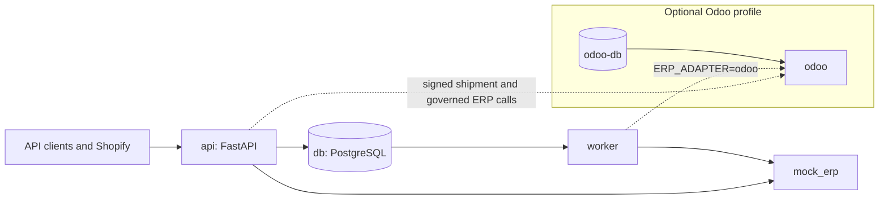

# Order Gateway


Order Gateway is a Python service for accepting orders, recording them in PostgreSQL, and delivering them to an ERP through a separate worker. It provides idempotent intake, retry handling, audit history, and operational controls so that an operator can see and respond to delivery problems; Shopify webhooks, governed workflows, proposals, and an Odoo adapter extend the same order path.

## Architecture

The default Compose stack has PostgreSQL (`db`), the FastAPI service (`api`), the in-memory fault-injectable ERP (`mock_erp`), and the delivery worker (`worker`). The optional `odoo` profile adds `odoo-db` and `odoo`; the application selects the mock or Odoo adapter through `ERP_ADAPTER`. (See [docker-compose.yml](docker-compose.yml) and [app/adapters/factory.py](app/adapters/factory.py).)



Order validation, idempotency, queue records, worker execution, and ERP adapters are described in [docs/architecture.md](docs/architecture.md). The project is for local development and demonstration with Docker Compose.

## Quickstart

You need Git, Docker Compose, and Python 3.12. The test suite also needs the Compose stack running because it uses PostgreSQL and the mock ERP. The commands below clone the repository, install the pinned project requirements into a virtual environment, start Compose, check health, run the host-side demo, and run pytest.

### Windows PowerShell

```powershell
git clone https://github.com/mediads786/order-gateway.git
Set-Location order-gateway
Copy-Item .env.example .env
py -3.12 -m venv .venv
.\.venv\Scripts\python.exe -m pip install -r requirements.txt
docker compose up -d --build
$health = $null
$deadline = (Get-Date).AddMinutes(2)
while (-not $health -and (Get-Date) -lt $deadline) {
    try { $health = Invoke-RestMethod http://localhost:8002/health }
    catch { Start-Sleep -Seconds 2 }
}
if (-not $health) { throw "Gateway health check did not succeed." }
$health
.\.venv\Scripts\python.exe scripts\demo_e2e.py
.\.venv\Scripts\python.exe -m pytest -v
```

### Linux or macOS

```sh
git clone https://github.com/mediads786/order-gateway.git
cd order-gateway
cp .env.example .env
python3.12 -m venv .venv
. .venv/bin/activate
python -m pip install -r requirements.txt
docker compose up -d --build
until curl --fail --silent http://localhost:8002/health; do sleep 2; done
python scripts/demo_e2e.py
python -m pytest -v
```

The sample `.env` uses local Compose PostgreSQL credentials and leaves optional secrets empty. For a demo using `LEGACY_AUTH=key`, set `DEMO_API_KEY` in the host environment to an active key with permission to create and read orders. The demo contacts the gateway and mock ERP on the configured URLs and uses Docker Compose to print the audit trail from the API container.

## Features

### Layer 1: engine

- Validates canonical orders and calculates totals using `Decimal`.
- Stores orders, jobs, idempotency records, and order audit events in PostgreSQL.
- Delivers due jobs through a worker using PostgreSQL row locks and `SKIP LOCKED`.
- Retries temporary ERP failures, recovers stale processing jobs, and exposes a manual retry for dead jobs.
- Provides server-rendered order, detail, and operations pages.
- Applies signed shipment requests synchronously through the Odoo adapter.

### Layer 2: governance

- Registers `create_order`, `adjust_stock`, and `cancel_order` workflows.
- Uses hashed API keys with `operator`, `approver`, and `admin` roles.
- Holds governed order creation above `APPROVAL_THRESHOLD`, and requires approval for stock adjustment and cancellation.
- Records workflow requests, decisions, and results in `workflow_events`.

### Layer 3: proposals

- Stores natural-language requests as proposals that can be reviewed, confirmed, or discarded.
- The rule proposer or optional Anthropic proposer can select only from allowed registered workflows and return schema-checked input. A proposer does not call the ERP; confirmation follows the normal governed workflow path.

### Shopify webhook

- Accepts signed `orders/create` webhooks, verifies the HMAC over the original body, maps supported customer/contact and line fields, and uses the Shopify webhook ID as the idempotency key.
- Stores unmappable valid JSON as a rejected order with the mapper's specific reason. Invalid JSON follows the ordinary invalid-input rejection path.

### Odoo adapter

- Provides an Odoo 19 JSON-2 adapter for order delivery, cancellation, governed stock adjustments, and signed shipment application.
- The optional Odoo Compose profile supplies Odoo and its PostgreSQL database. See the setup and verification notes in [docs/odoo-notes.md](docs/odoo-notes.md).

## Three-minute demo

With the Compose stack running and the Python requirements installed, run `python scripts/demo_e2e.py` (or the virtual-environment Python shown above). The script checks health, submits and replays an order, injects a mock ERP 500 response for a second order, waits for a retry and recovery, and prints that order's audit trail. It resets mock ERP faults when it exits. See [the demo script](scripts/demo_e2e.py) and [the architecture guide](docs/architecture.md).

## Configuration

Defaults below come from `.env.example`, `docker-compose.yml`, or the code. Values such as credentials and URLs should be set for the environment where the relevant service runs.

| Variable | Default | Purpose |
| --- | --- | --- |
| `DATABASE_URL` | Local Compose PostgreSQL URL | Application database connection. |
| `TEST_DATABASE_URL` | Local PostgreSQL `order_gateway_test` URL | Isolated pytest database; the test setup requires a database name ending in `_test`. |
| `ERP_ADAPTER` | `mock` | Selects `mock` or `odoo`. |
| `ERP_BASE_URL` | `http://mock_erp:9001` | Mock ERP base URL used by the gateway adapter. |
| `ERP_TIMEOUT_SECONDS` | `5` | ERP HTTP timeout. |
| `WORKER_POLL_INTERVAL_SECONDS` | `1` | Worker idle polling interval. |
| `RETRY_BASE_SECONDS` | `2` | Retry backoff base. |
| `RETRY_MAX_SECONDS` | `60` | Retry backoff cap. |
| `MAX_ATTEMPTS` | `5` | Maximum worker attempts before a dead job. |
| `STALE_JOB_SECONDS` | `120` | Age after which a processing job is recovered. |
| `SHOPIFY_WEBHOOK_SECRET` | Empty | Shopify webhook HMAC secret. |
| `SHIPMENT_WEBHOOK_SECRET` | Empty | Shipment request HMAC secret. |
| `ADMIN_TOKEN` | Empty | Shared admin login token; admin pages are disabled if shorter than 16 characters. |
| `APPROVAL_THRESHOLD` | `1000.00` | Governed order total above which order creation waits for approval. |
| `LEGACY_AUTH` | `off` | Set to `key` to require role-based API keys on the original order routes. |
| `PROPOSER` | `rule` | Selects `rule` or `anthropic`. |
| `DEFAULT_CURRENCY` | `PKR` | Default currency used by the rule proposer. |
| `ANTHROPIC_API_KEY` | Empty | API key when `PROPOSER=anthropic`. |
| `PROPOSER_MODEL` | `claude-sonnet-5-5` | Model sent to the Anthropic Messages API. |
| `PROPOSER_TIMEOUT_SECONDS` | `20` | Proposer request timeout. |
| `PROPOSAL_DAILY_LIMIT` | `50` | Per-key daily proposal limit. |
| `PROPOSAL_TEXT_MAX_CHARS` | `1000` | Maximum proposal text length. |
| `ODOO_BASE_URL` | Empty | Odoo base URL. With the Compose `odoo` profile use `http://odoo:8069`; the worker will not start with `ERP_ADAPTER=odoo` while it is empty. |
| `ODOO_DB` | `gateway` | Odoo database header value. |
| `ODOO_API_KEY` | Empty | Odoo JSON-2 bearer credential. |
| `ODOO_EXPECTED_CURRENCY` | `USD` | Currency accepted by the Odoo order adapter. |
| `ODOO_WAREHOUSE_CODE` | `WH` | Warehouse used by Odoo stock operations. |
| `ODOO_IMAGE` | `odoo:19.0` | Image used by the optional Compose Odoo profile. |
| `ODOO_PG_USER` | `odoo` | Optional Odoo database username. |
| `ODOO_PG_PASSWORD` | Example placeholder | Optional Odoo database password; replace it before using the profile. |
| `ODOO_LIVE` | Unset | Set to `1` for the opt-in live Odoo smoke test. |
| `GATEWAY_URL` | `http://localhost:8002` | Host-side `demo_e2e.py` gateway URL override. |
| `MOCK_ERP_URL` | `http://127.0.0.1:9001` | Host-side demo mock ERP URL override. |
| `DEMO_API_KEY` | Unset | Optional `X-API-Key` sent by the host-side demo. |

## Known limitations

- The original order routes are open by default unless `LEGACY_AUTH=key` is enabled. The admin uses one shared token and has no per-user identity or login rate limiting. (See [app/governance/legacy.py](app/governance/legacy.py), [app/admin/auth.py](app/admin/auth.py), and [app/main.py](app/main.py).)
- Shopify supports only the `orders/create` topic. Orders that lack a usable name or both email and phone cannot be mapped; a different webhook ID for the same Shopify order is a different idempotency key. See [docs/shopify-live-test.md](docs/shopify-live-test.md).
- Shipments are synchronous and the Odoo implementation uses one configured warehouse. There is no cumulative shipped-versus-ordered quantity check, and counted-quantity updates can race with other Odoo stock changes. (See [app/services/shipments.py](app/services/shipments.py) and [app/adapters/odoo.py](app/adapters/odoo.py).)
- One gateway-to-Odoo run is recorded (order delivery and a governed cancel; see [docs/odoo-e2e-run.md](docs/odoo-e2e-run.md)). Signed shipments and governed stock adjustments have not been run against Odoo. [docs/odoo-notes.md](docs/odoo-notes.md) records which individual API calls were probed.
- Pending approvals do not expire. An order with unknown ERP state may be refused for cancellation, and a crash between an ERP cancellation and the gateway update may leave an approval requiring manual recovery. (See [app/governance/approvals.py](app/governance/approvals.py).)
- Anthropic proposer behavior is not recorded as live-API verified. Proposal text is retained in the database, and confirming a failed proposal does not automatically retry it. (See [app/proposals/routes.py](app/proposals/routes.py) and [app/proposals/service.py](app/proposals/service.py).)

## Further reading

- [Architecture](docs/architecture.md)
- [Case study](docs/case-study.md)
- [Shopify live test notes](docs/shopify-live-test.md)
- [Odoo JSON-2 notes](docs/odoo-notes.md)
- [Odoo end-to-end run](docs/odoo-e2e-run.md)
