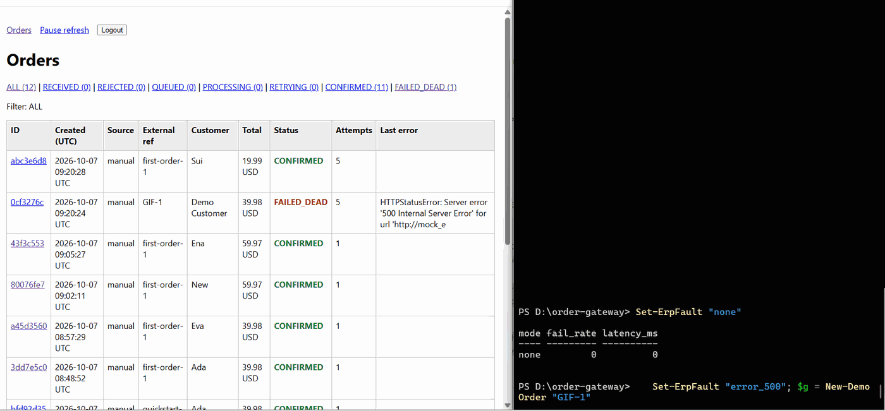
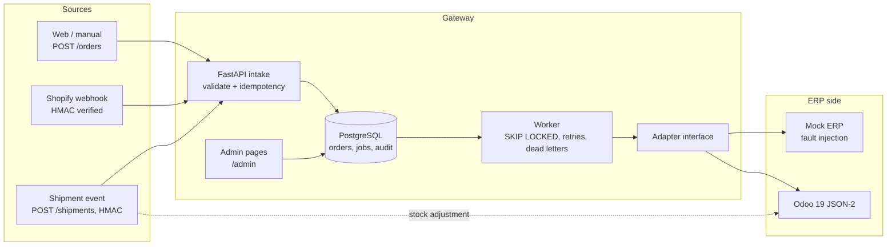
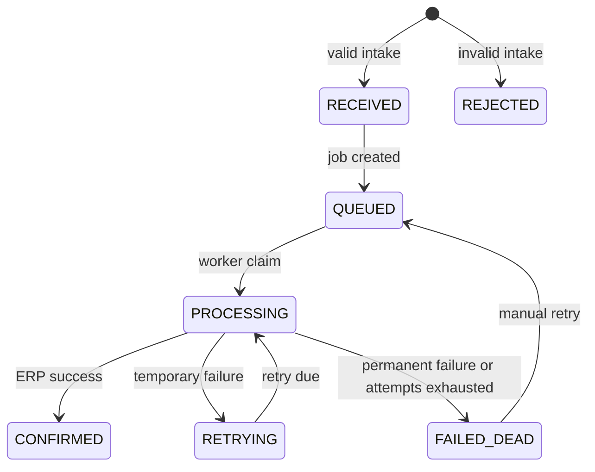

# Order Gateway

An idempotent order intake and delivery service that stores orders in PostgreSQL, retries ERP delivery, and provides an operations view.



## What it does

- Delivers orders reliably to an ERP through a worker.
- Accepts idempotent canonical orders and Shopify `orders/create` webhooks.
- Retries temporary ERP failures and records exhausted jobs as dead letters.
- Keeps an append-only audit trail for orders and shipments.
- Supports a mock ERP by default, an Odoo 19 adapter, and signed shipment adjustments.

## Architecture



The API validates and stores orders and idempotency records in one PostgreSQL transaction. Valid orders create a queued job and audit event atomically. A separate worker claims jobs with `FOR UPDATE SKIP LOCKED`, calls the configured ERP adapter, and records retry or completion events. Shopify orders are authenticated from their original request bytes before mapping. Shipment requests are signed and applied synchronously through the Odoo adapter. The server-rendered admin pages read the same order, job, shipment, and audit tables.



## Quickstart (10 minutes)

Prerequisites: Docker Desktop, Git, PowerShell, and about 2 GB of RAM for the default demo.

From a fresh clone, run these commands in the repository root. Create a 32-character token using the shown PowerShell expression, then paste it into `.env` as `ADMIN_TOKEN` before starting Compose.

```powershell
Copy-Item .env.example .env
notepad .env
docker compose up -d --build
```

Token generator:

```powershell
-join ((48..57) + (97..122) | Get-Random -Count 32 | ForEach-Object { [char]$_ })
```

The API is at `http://localhost:8002`; open the admin page at `http://localhost:8002/admin`, API docs at `http://localhost:8002/docs`, and health at `http://localhost:8002/health`. The API container runs `alembic upgrade head` before Uvicorn starts; the worker waits for the API healthcheck. Sign in with the `ADMIN_TOKEN` value.

Send a first order from PowerShell:

```powershell
$body = '{"source":"manual","external_ref":"quickstart-1","customer":{"name":"Ada","email":"ada@example.com"},"currency":"USD","lines":[{"sku":"BOOK","qty":2,"unit_price":"19.99"}]}'
$key = [guid]::NewGuid().ToString()
Invoke-RestMethod -Method Post -Uri http://localhost:8002/orders -Headers @{"Idempotency-Key"=$key} -ContentType "application/json" -Body $body
```

Prices must be JSON strings. Numeric prices are rejected by design to avoid converting binary floats into money.

To run the real-PostgreSQL tests from the host, create the local environment and install the pinned test dependencies:

```powershell
py -3.12 -m venv .venv
.\.venv\Scripts\python.exe -m pip install -r requirements.txt
```

Then run the tests after Compose is up:

```powershell
.\.venv\Scripts\python.exe -m pytest -v
```

The test fixture reads `TEST_DATABASE_URL` from the environment or `.env`, creates the named test database if missing, checks that its name ends in `_test`, and sets `DATABASE_URL` to it before importing the app.

## Demo

Follow the [3-minute PowerShell demo](docs/demo.md).

## Admin pages

`/admin` provides a status-filtered order list with counts, a detail page with lines, job state, shipments and the oldest-first audit trail, and a retry button for `FAILED_DEAD` orders. The shared `ADMIN_TOKEN` is compared with a constant-time check; the browser receives a signed `gw_admin` cookie, never the token itself. Admin responses disable caching and framing and use a restrictive content security policy. State changes use POST forms, and `SameSite=Strict` cookies provide the v1 CSRF protection. `ADMIN_TOKEN` must contain at least 16 characters; otherwise all admin routes return `503 admin_disabled`.

The admin has one shared identity, so an admin retry audit event cannot identify an individual, and there is no login rate limiting. The API retry endpoint remains unauthenticated in v1. Cookies are marked `Secure` only when served over HTTPS; plain local HTTP does not set that attribute.

## How it works

### Idempotency and retries

`POST /orders` requires `Idempotency-Key`. The gateway hashes the request body and serializes concurrent same-key requests with a PostgreSQL advisory transaction lock. The same key and body replays the saved response; a different body returns `409`.

The worker claims one due job using `FOR UPDATE SKIP LOCKED`, increments attempts, and calls the ERP outside the claim transaction. Retryable failures use capped exponential backoff with jitter. The defaults are at most 5 attempts, 2 seconds base, and 60 seconds cap. HTTP 429, 5xx, timeouts and transport errors retry; permanent HTTP/business errors do not. An exhausted or permanent failure marks the order `FAILED_DEAD`. Stale `PROCESSING` jobs are recovered after `STALE_JOB_SECONDS`.

The audit trail includes `order.received`, `order.rejected`, `order.queued`, `order.processing`, `order.retrying`, `order.confirmed`, `order.failed`, `order.recovered_stale`, and `order.requeued`, with attempt and error details as applicable. Shipment events are `shipment.received`, `shipment.applied`, and `shipment.failed`.

### Shopify webhook

`POST /webhooks/shopify/orders-create` verifies the base64 HMAC-SHA256 signature over the raw request body, then maps the `orders/create` webhook to canonical order fields. The Shopify webhook ID is the gateway idempotency key. Only the mapped customer/contact, currency, line SKU, quantity and string unit price are forwarded; Shopify totals, taxes, discounts and shipping are ignored. Missing SKU or contact rejects the order.

### Odoo adapter and shipments

Odoo uses the JSON-2 API with an API key bearer token. XML-RPC/JSON-RPC are not used because they were deprecated in Odoo 19 and parts are removed in Odoo 20. Order creation searches `sale.order.client_order_ref` before create so a retry after a lost response reuses the same ERP order.

| Gateway field | Odoo field | Mapping |
| --- | --- | --- |
| order external key | `sale.order.client_order_ref` | `GW-` plus the worker's gateway UUID external ID |
| customer | `res.partner` | Search case-insensitive email; otherwise exact name and phone; create when missing |
| currency | — | Must equal `ODOO_EXPECTED_CURRENCY` |
| `lines[].sku` | `product.product.default_code` | Exact active match; unknown or ambiguous SKU is permanent failure |
| `lines[].qty` | `order_line.product_uom_qty` | Integer quantity |
| `lines[].unit_price` | `order_line.price_unit` | `Decimal` converted to JSON number only at the Odoo boundary |
| lines | `order_line` | Odoo ORM command list `[[0, 0, {...}], ...]` |

`POST /shipments` requires an HMAC-SHA256 signature in `X-Gateway-Signature`. The shipment row and `shipment.received` event are stored before the synchronous stock adjustment. Odoo inventory markers make each line idempotent; a repeated applied shipment replays the stored response. This PowerShell example reads the secret from `.env` without printing it:

```powershell
$OrderId = Read-Host "Confirmed gateway order UUID"
$ShipmentId = "SHP-$([guid]::NewGuid())"
$ShipmentSecret = (Get-Content .env | Where-Object { $_ -match '^SHIPMENT_WEBHOOK_SECRET=' } | Select-Object -First 1) -replace '^SHIPMENT_WEBHOOK_SECRET=', ''
$ShipmentBody = @{ shipment_id = $ShipmentId; order_id = $OrderId; lines = @(@{ sku = "BOOK"; qty = 1 }) } | ConvertTo-Json -Compress -Depth 5
$Hmac = [Security.Cryptography.HMACSHA256]::new([Text.Encoding]::UTF8.GetBytes($ShipmentSecret))
$Signature = [Convert]::ToBase64String($Hmac.ComputeHash([Text.Encoding]::UTF8.GetBytes($ShipmentBody)))
Invoke-RestMethod -Method Post -Uri http://localhost:8002/shipments -ContentType "application/json" -Headers @{ "X-Gateway-Signature" = $Signature } -Body $ShipmentBody
```

Reuse this signing example for [the optional Odoo demo](docs/demo.md#optional-odoo-demo).

To start the optional Odoo profile, initialize its own database and then run the Odoo service:

```powershell
docker compose --profile odoo up -d odoo-db
docker compose --profile odoo run --rm odoo odoo -d gateway -i base,sale_management,stock --without-demo=all --stop-after-init
docker compose --profile odoo up -d odoo
```

Wait for `http://localhost:8069`, create an API key under Preferences → Account Security, and put it in `.env` as `ODOO_API_KEY`. Set `ERP_ADAPTER=odoo`, `ODOO_BASE_URL=http://odoo:8069`, and `ODOO_DB=gateway` in `.env`, then run `docker compose --profile odoo up -d --build`. Seed the fixture SKUs and opening inventory with:

```powershell
$env:ODOO_BASE_URL = "http://localhost:8069"
.\.venv\Scripts\python.exe scripts\odoo_seed.py
```

The [Odoo API notes](docs/odoo-notes.md) contain the verified local request/response observations.

For the opt-in live smoke test, seed a SKU and set the host-reachable Odoo URL:

```powershell
$env:ODOO_BASE_URL = "http://localhost:8069"
$env:ODOO_LIVE = "1"
.\.venv\Scripts\python.exe -m pytest -m live_odoo -v
```

## Configuration

| Variable | Default | Meaning | Secret? |
| --- | --- | --- | --- |
| `DATABASE_URL` | Compose PostgreSQL URL | Application database | No (local dev credentials) |
| `TEST_DATABASE_URL` | `order_gateway_test` on port 5433 | Isolated pytest database; name must end `_test` | No (local dev credentials) |
| `ERP_ADAPTER` | `mock` | `mock` or `odoo` | No |
| `ERP_BASE_URL` | `http://mock_erp:9001` | Mock ERP endpoint | No |
| `ERP_TIMEOUT_SECONDS` | `5` | ERP request timeout | No |
| `WORKER_POLL_INTERVAL_SECONDS` | `1` | Worker idle polling interval | No |
| `RETRY_BASE_SECONDS` | `2` | Exponential retry base | No |
| `RETRY_MAX_SECONDS` | `60` | Retry delay cap | No |
| `MAX_ATTEMPTS` | `5` | Maximum worker attempts | No |
| `STALE_JOB_SECONDS` | `120` | Stale claim recovery threshold | No |
| `SHOPIFY_WEBHOOK_SECRET` | empty | Shopify webhook HMAC secret | Yes |
| `SHIPMENT_WEBHOOK_SECRET` | empty | Shipment HMAC secret | Yes |
| `ADMIN_TOKEN` | empty | Admin login token; minimum 16 characters | Yes |
| `ODOO_BASE_URL` | empty | Odoo JSON-2 base URL | No |
| `ODOO_DB` | `gateway` | Odoo database header | No |
| `ODOO_API_KEY` | empty | Odoo bearer API key | Yes |
| `ODOO_EXPECTED_CURRENCY` | `USD` | Accepted Odoo order currency | No |
| `ODOO_WAREHOUSE_CODE` | `WH` | Odoo stock warehouse | No |
| `ODOO_IMAGE` | `odoo:19.0` | Pinned Odoo image tag | No |
| `ODOO_PG_USER` | `odoo` | Odoo-only PostgreSQL user | No |
| `ODOO_PG_PASSWORD` | placeholder in `.env.example` | Odoo-only PostgreSQL password | Yes |
| `ODOO_LIVE` | unset | Set to `1` to run the opt-in live Odoo smoke test | No |

## What is verified and what is not

- Automated test count: `123 passed, 1 skipped (the opt-in live Odoo test, which also passed locally)`.
- Odoo live smoke test: passed locally with the opt-in `ODOO_LIVE=1` setting.
- Shopify live-store test: not yet done; mapping fixtures and signature behavior are tested locally.
- Odoo API calls are documented in [docs/odoo-notes.md](docs/odoo-notes.md); the sale-order create flow should also be checked with the opt-in live smoke test for the Odoo instance in use.

## Known limitations

- Shopify `total_price` is ignored; the gateway computes the total from lines.
- A missing Shopify SKU rejects the order.
- The same Shopify order under a different webhook ID creates a second order.
- Only one Shopify topic is supported.
- Two simultaneous first orders for one new Odoo customer can create duplicate partner records.
- Money converts to float only at the Odoo JSON boundary.
- Counted-quantity stock adjustments can race with other Odoo stock changes.
- There is no cumulative shipped-versus-ordered quantity check.
- Shipments are synchronous and use one warehouse.
- Order currency must match `ODOO_EXPECTED_CURRENCY`.
- Odoo Online plans may restrict external API access.
- Admin uses one shared token, has no per-user identity and no login rate limiting.
- The API retry endpoint has no authentication in v1.
- The admin cookie is not marked `Secure` over plain HTTP.

## Roadmap

- Layer 2: workflow registry, roles and approvals.
- Layer 3: natural-language proposals that can only propose changes.

## Project layout

```text
app/                 FastAPI app, adapters, admin pages, services and worker
migrations/          Alembic schema history
mock_erp/            In-memory mock ERP and fault injection
tests/               PostgreSQL-backed tests and recorded Odoo fixtures
docs/                Odoo notes, demo script and portfolio checklist
docker-compose.yml   Local services and optional Odoo profile
```
