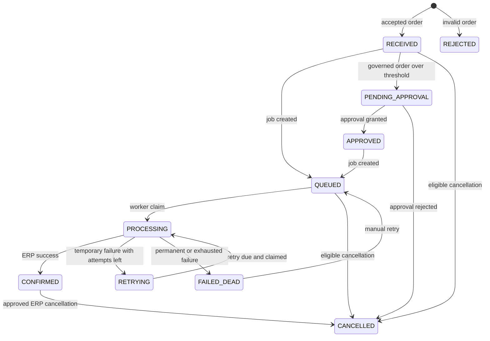

# Architecture

Order Gateway is a FastAPI application backed by PostgreSQL. Docker Compose starts `db`, `api`, `mock_erp`, and `worker`; the optional `odoo` profile adds `odoo-db` and `odoo`. The API serves intake, webhooks, workflow and proposal routes, shipment application, and server-rendered admin pages. The worker independently reads due jobs and calls the configured ERP adapter. (See `docker-compose.yml`, `app/main.py`, `app/adapters/factory.py`, and `app/workers/worker.py`.)

## Components

- **API:** Validates canonical orders and stores them through the order service. It also verifies Shopify and shipment signatures, exposes workflow and proposal routes, and serves the admin UI. (`app/main.py`, `app/services/orders.py`, `app/services/shipments.py`, `app/governance/routes.py`, `app/proposals/routes.py`, `app/admin/routes.py`.)
- **PostgreSQL:** Stores orders, order lines, jobs, idempotency records, order audit events, shipments, API keys, workflow events, approvals, and proposals. (`app/db/models.py`, `migrations/versions/`.)
- **Worker:** Claims a due job, marks the order and job as processing, calls `ERP_ADAPTER`, then stores a success or failure result. (`app/workers/worker.py`, `app/adapters/factory.py`.)
- **Mock ERP:** A separate in-memory FastAPI service with order creation, cancellation, stock adjustment, and fault injection routes. Its records and fault settings are process memory, not PostgreSQL data. (`mock_erp/main.py`.)
- **Odoo:** An optional adapter target using the JSON-2 API. The API selects the adapter for governed stock operations and synchronous shipments; the worker uses it for order delivery. (`app/adapters/odoo.py`, `app/adapters/factory.py`, `app/services/shipments.py`.)

## Order and job states

Order state names used in code are `RECEIVED`, `REJECTED`, `PENDING_APPROVAL`, `APPROVED`, `QUEUED`, `PROCESSING`, `CONFIRMED`, `RETRYING`, `FAILED_DEAD`, and `CANCELLED`. Ordinary valid intake creates `RECEIVED`; a job is created as `QUEUED`. Worker claims change both to `PROCESSING`; success changes the order to `CONFIRMED`. A retryable failure with attempts remaining changes the order to `RETRYING` and schedules the job as `QUEUED`. Permanent or exhausted failure changes the order to `FAILED_DEAD`. A manual retry changes that order and failed job back to `QUEUED`. Invalid input is `REJECTED`. Governed order approval uses `PENDING_APPROVAL`, then passes through approval before queueing; an approval rejection sets the order to `CANCELLED`. Cancellation can also set an eligible order and its job to `CANCELLED`. (`app/services/orders.py`, `app/workers/worker.py`, `app/services/retry.py`, `app/governance/approvals.py`.)

Job states used in code are `QUEUED`, `PROCESSING`, `DONE`, `FAILED`, and `CANCELLED`. A successful worker delivery ends with job `DONE`; a permanent or exhausted delivery failure ends with job `FAILED`. Retrying is represented by an order state of `RETRYING` and a job state of `QUEUED`, with `next_attempt_at` controlling when it is due. (`app/workers/worker.py`, `app/governance/approvals.py`, `app/db/models.py`.)

## Retry policy and queue

The worker defaults to a one-second idle poll, five maximum attempts, a two-second backoff base, a 60-second backoff cap, and a 120-second stale-job threshold. Backoff grows exponentially by attempt and is randomized between one half and the full calculated delay, capped at 60 seconds. HTTP 429, HTTP 5xx, transport errors, and invalid adapter responses are retryable; permanent adapter errors and other HTTP errors are not. A due job is selected in `created_at`/due order and locked with PostgreSQL `FOR UPDATE SKIP LOCKED`, so a competing worker can claim a different row. Stale `PROCESSING` jobs are recovered or failed based on remaining attempts. (`app/workers/worker.py`.)

## Idempotency

`POST /orders` requires `Idempotency-Key`. The order service parses and hashes the request, acquires a PostgreSQL advisory transaction lock based on the key, and stores the response and order in a transaction. A repeat with the same key and request hash replays the saved response; reuse of that key with a different hash returns a conflict. Shopify uses `shopify:<webhook ID>` as the idempotency key. Invalid JSON uses a hash of its original bytes. (`app/main.py`, `app/services/orders.py`, `app/services/shopify_webhooks.py`.)

## Audit data

`audit_events` records order events such as `order.received`, `order.queued`, `order.processing`, `order.retrying`, `order.confirmed`, and `order.failed`; shipment events are also attached to the order. Application flows add new rows as state changes occur. (`app/db/models.py`, `app/services/orders.py`, `app/workers/worker.py`, `app/services/shipments.py`.)

`workflow_events` records request IDs, actor/key metadata, workflow, event type, HTTP status, optional order ID, input hash, and detail. The migration installs a PostgreSQL trigger that rejects updates and deletes on this table. Workflow and proposal actions record events through the governance audit and proposal services. (`app/db/models.py`, `migrations/versions/0006_workflow_governance.py`, `app/governance/audit.py`, `app/governance/routes.py`, `app/proposals/service.py`.)

## Governance and approvals

The workflow registry defines `create_order`, `adjust_stock`, and `cancel_order`; request and decision roles are checked against that registry. API key records store SHA-256 hashes, with roles `operator`, `approver`, and `admin`. Governed order creation waits for approval when its computed `Decimal` total is above `APPROVAL_THRESHOLD`. Stock adjustment and cancellation always create approvals. (`app/governance/registry.py`, `app/governance/keys.py`, `app/governance/routes.py`, `app/governance/approvals.py`.)

For `cancel_order`, the approval stores the target UUID in its `input`; `approvals.order_id` is not the cancellation target. Eligibility is checked on request and again during approval execution. Only a different approver or admin can decide; successful local or ERP cancellation updates the relevant order/job and records events. (`app/governance/approvals.py`, `app/governance/routes.py`, `app/db/models.py`.)

## Proposals

Proposal creation sends user text to the selected rule or optional Anthropic proposer with the role-allowed workflow schemas. The returned workflow and input are checked against the registry and its input model before a proposal can be marked `PROPOSED`. A proposal is a stored draft; it cannot call an ERP. Confirmation by its requester passes the validated input to the normal governed workflow path, where role checks, idempotency, and approvals apply. (`app/proposals/proposers.py`, `app/proposals/routes.py`, `app/proposals/service.py`, `app/governance/routes.py`.)

## `LEGACY_AUTH`

With `LEGACY_AUTH=off`, the original order create, read, and retry routes do not require API keys. With `LEGACY_AUTH=key`, those routes authenticate `X-API-Key` and enforce each route's role allowlist. Shopify and shipment webhook authentication remain signature-based. (`app/governance/legacy.py`, `app/main.py`.)
