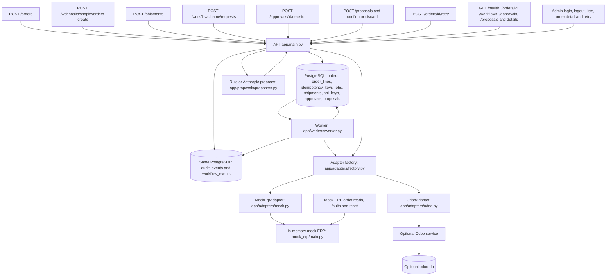

# Order Gateway project tour

This guide describes the checked-in implementation. HTTP is the request-and-response protocol used by callers. An API is the set of routes callers can use. An ERP is the business system that receives orders or stock changes. PostgreSQL is the database. A worker is a separate process that delivers saved work. These components are wired in `app/main.py`, `app/workers/worker.py`, and `docker-compose.yml`.

A route is a URL and method handled by a function. POST submits an action; GET reads information. An HTTP status code tells the caller the outcome: 200 is success, 201 creation, 202 acceptance for later action, and 303 a redirect. Codes in the 400 range reject a caller request; codes in the 500 range report a server-side failure. A container packages a running service, and Compose wires those services together. The route handlers and service wiring are in `app/main.py` and `docker-compose.yml`.

An API key is a secret credential sent by a caller. HMAC-SHA256 is a signature made from a shared secret and message; base64 encodes its bytes as header text. SHA-256 alone makes a fixed-length input fingerprint, called a hash or digest. A UUID is a structured unique identifier. UTC is the common time standard used for stored event times. JSON is structured text for request bodies, while HTML is browser page markup. A thread pool runs blocking work away from the asynchronous request loop. Examples are in `app/governance/keys.py`, `app/services/shopify_webhooks.py`, `app/db/models.py`, `app/admin/views.py`, and `app/main.py`.

## 1. System workflow

### Whole system



The API stores intake and the worker reads jobs from the same database. A job is a saved delivery task. The audit boxes are tables in that database, not separate services. Normal order delivery uses the worker; shipments and approved stock or ERP cancellation calls execute during the API request. See `app/services/orders.py:submit_order`, `app/workers/worker.py:process_one`, `app/services/shipments.py:apply_shipment`, and `app/governance/approvals.py:decide`.

The adapter translates gateway data into the selected ERP's calls. The mock ERP keeps records in memory; Odoo has its own optional database service. Proposal creation produces a stored draft before confirmation enters governance. Admin pages read operational records and offer manual retry. See `app/adapters/factory.py:get_adapter`, `mock_erp/main.py`, `docker-compose.yml`, `app/proposals/routes.py`, and `app/admin/routes.py`.

### Happy path: accepted, queued, delivered, confirmed

```mermaid
sequenceDiagram
    participant Caller
    participant API as app/main.py:create_order
    participant Intake as app/services/orders.py:submit_order
    participant DB as PostgreSQL
    participant Worker as app/workers/worker.py:process_one
    participant Adapter as Selected ERP adapter
    participant ERP as Mock ERP or Odoo
    Caller->>API: POST /orders with Idempotency-Key
    API->>Intake: Raw body and key
    Intake->>DB: Lock key; save RECEIVED order, lines, QUEUED job, events and response
    DB-->>Intake: Commit
    Intake-->>Caller: HTTP 201, order status RECEIVED
    Worker->>DB: Claim due job; PROCESSING; increment attempts; commit
    Worker->>Adapter: create_sales_order with gateway order ID
    Adapter->>ERP: Create or find existing sales order
    ERP-->>Adapter: ERP order identifier
    Adapter-->>Worker: ErpOrderResult
    Worker->>DB: Job DONE; order CONFIRMED; ERP ID; order.confirmed
    Caller->>API: GET /orders/order_id
    API->>DB: Read order and audit events
    API-->>Caller: HTTP 200, current status CONFIRMED
```

Acceptance does not wait for the ERP. Ordinary intake writes an order as `RECEIVED` and a job as `QUEUED` in one transaction, meaning all those writes commit together or roll back together. `order.queued` records that a job exists; it does not change the ordinary intake order to `QUEUED`. See `app/services/orders.py:submit_order` and `app/services/orders.py:create_queued_job`.

The worker commits its claim before calling the ERP. Success stores the ERP identifier and changes the order to `CONFIRMED`. Odoo confirms the sale order before returning; the mock returns an identifier for its stored record. Confirmation here means the adapter accepted delivery, not that goods reached a customer. See `app/workers/worker.py:_claim_one`, `app/workers/worker.py:_mark_done`, `app/adapters/odoo.py:create_sales_order`, and `mock_erp/main.py:create_sales_order`.

### Failure path: backoff, recovery, exhaustion and manual retry

```mermaid
sequenceDiagram
    participant Worker as app/workers/worker.py
    participant DB as PostgreSQL
    participant ERP as ERP through adapter
    participant Operator
    participant API as app/main.py:retry_order
    Worker->>DB: Claim job, increment attempts, PROCESSING
    Worker->>ERP: create_sales_order
    ERP-->>Worker: HTTP 500
    Worker->>DB: Job QUEUED for later; order RETRYING; order.retrying
    Note over Worker,DB: Due time uses capped exponential backoff with jitter
    alt ERP recovers while attempts remain
        Worker->>DB: Claim when next_attempt_at is due
        Worker->>ERP: Retry same external identifier
        ERP-->>Worker: ERP order identifier
        Worker->>DB: DONE, CONFIRMED, order.confirmed
    else Retryable failures exhaust MAX_ATTEMPTS
        loop Remaining due attempts
            Worker->>ERP: Retry after due claim
            ERP-->>Worker: HTTP 500
        end
        Worker->>DB: Job FAILED; order FAILED_DEAD; order.failed reason max_attempts
        Operator->>API: POST /orders/order_id/retry
        API->>DB: Lock order and job; reset attempts; QUEUED; order.requeued
        API-->>Operator: HTTP 200, status QUEUED
        Worker->>ERP: New delivery attempt with same external identifier
        ERP-->>Worker: ERP order identifier if recovered
        Worker->>DB: DONE, CONFIRMED, order.confirmed
    end
    opt Worker lost after a claim
        Worker->>DB: recover_stale_jobs examines old PROCESSING jobs
        Note over Worker,DB: Requeue immediately or fail when attempts exhausted
    end
```

Backoff means waiting longer between attempts; jitter means adding randomness to that wait. The delay is between half and all of `min(cap, base * 2^(attempt - 1))`. Generic HTTP 500, HTTP 429, transport errors and malformed success values can retry. Odoo first examines error names, so an Odoo business error returned as HTTP 500 can be permanent instead. See `app/workers/worker.py:compute_backoff`, `app/workers/worker.py:classify_failure`, and `app/adapters/odoo.py:_call`.

Retryable failure at the attempt limit becomes `FAILED_DEAD`; a permanent failure can reach it immediately. Manual retry resets attempts and schedules the existing job now. Stale recovery handles a processing job whose claim is too old, but repeated delivery remains possible after a lost response or an overly short stale timeout. See `app/workers/worker.py:_mark_failure`, `app/workers/worker.py:recover_stale_jobs`, and `app/services/retry.py:requeue_failed_order`.

## 2. What happens when data enters the system

Each indented numbered list is a call tree. JSON is the structured text format used for bodies. Validation checks whether input matches an expected shape, called a schema. Idempotency makes a repeated request reuse its saved result. Authentication checks a credential; authorization checks the credential's allowed role. Shared checks below are part of every trace that references them. See `app/core/schemas.py`, `app/governance/keys.py`, `app/governance/registry.py`, and `app/services/orders.py`.

### Shared order validation and replay

1. `app/services/orders.py:submit_order` parses JSON, refuses non-finite numbers such as NaN, invalid encoding or syntax, and NUL characters; these go to the rejection branch.
   1. `app/core/schemas.py:OrderInput` accepts only web, whatsapp, shopify or manual; requires a three-letter currency and nonempty lines; extra fields are forbidden.
      1. `app/core/schemas.py:CustomerInput` trims name and phone, requires a nonempty name and phone or valid email; extra fields are forbidden.
      2. `app/core/schemas.py:LineInput` trims SKU, requires nonempty SKU, a strict positive integer quantity and nonnegative Decimal price; float prices are refused, but integer prices are not explicitly refused.
   2. `app/services/orders.py:_request_hash` hashes sorted parsed JSON before model normalization; invalid JSON, non-finite numbers and NUL branches instead hash original bytes.
   3. `app/services/orders.py:_lock_idempotency_key` takes a transaction-scoped PostgreSQL advisory lock for the key, then reads `idempotency_keys` inside the write transaction.
      1. `app/services/orders.py:_replay_status` returns the saved body for matching hash: initial 201 replays as 200, while saved 202 and 422 keep their codes; no new rows or events.
      2. `app/services/orders.py:submit_order` or `_rejected_order` returns 409 with `detail` if the existing key's hash differs; no new order.
   4. `app/services/orders.py:_rejected_order` writes `orders` with total zero, status REJECTED and retained payload, `audit_events` event `order.rejected`, and `idempotency_keys` with body and code 422; writes no job or lines.
      1. `app/core/reasons.py:summarize_reasons` shortens schema reasons and adds a Shopify routing hint when the body has the recognized Shopify fields; `app/services/orders.py:_validation_reasons` supplies field names.
      2. `app/services/orders.py:_rejected_order` ends with HTTP 422, order ID, REJECTED and reasons; replay/conflict can replace this result as described above.
   5. `app/services/orders.py:submit_order` computes total from quantity times price, uppercases currency and writes `orders`, `order_lines`, `order.received` in `audit_events`, then either a job or a held approval, and the saved `idempotency_keys` response.

These are explicit application outcomes. Database and unexpected programming errors without a route handler are not converted into a stable error body. The exact infrastructure error response is not verified. Routes with typed UUID or integer parameters also have framework validation rather than a custom response body. See `app/main.py`, `app/governance/routes.py`, `app/governance/approvals.py`, and `app/proposals/routes.py`.

### POST /orders

1. `app/main.py:create_order` calls `app/governance/legacy.py:legacy_guard`: default LEGACY_AUTH=off is open; key mode requires active X-API-Key with operator or admin role; unknown modes enforce key mode.
   1. `app/governance/keys.py:authenticate_api_key` reads `api_keys` by SHA-256 hash; missing, unknown or inactive key returns 401 unauthorized with no event.
   2. `app/governance/legacy.py:legacy_guard` returns 403 forbidden for another role and writes `workflow.denied` to `workflow_events`, labeled `legacy:create_order`, with actor and body hash.
2. `app/main.py:create_order` requires Idempotency-Key; missing header ends with HTTP 400 and detail; no intake rows.
   1. `app/services/orders.py:submit_order` follows all shared validation/replay steps above; keyed legacy calls add requested_by to received or rejected event details.
   2. `app/services/orders.py:create_queued_job` writes `jobs` QUEUED and `audit_events` event `order.queued`; ordinary intake leaves the order RECEIVED and uses no approval threshold.
3. `app/main.py:create_order` ends with HTTP 201 and serialized accepted order, HTTP 200 saved accepted replay, HTTP 422 stored rejection/replay, or HTTP 409 conflicting key; the response contains the saved intake status, not a fresh worker status.

### POST /webhooks/shopify/orders-create

1. `app/main.py:shopify_orders_create` reads raw bytes and SHOPIFY_WEBHOOK_SECRET; empty secret returns 503 with detail and log `Shopify webhook secret is not configured`; no database writes.
   1. `app/services/shopify_webhooks.py:verify_signature` checks base64 HMAC-SHA256 over those exact bytes using constant-time comparison; missing, malformed, wrong or tampered signature returns 401 with detail and log `Rejected Shopify webhook with invalid signature`; no writes.
2. `app/main.py:shopify_orders_create` requires nonblank X-Shopify-Webhook-Id; absent/blank returns 400; another supplied X-Shopify-Topic returns 200 with status ignored and no writes; missing topic is allowed.
   1. `app/main.py:shopify_orders_create` constructs `shopify:<webhook ID>` as the idempotency key; it does not use the Shopify order ID as that key.
   2. `app/services/shopify_webhooks.py:map_shopify_order` requires an object and usable order ID; selects name from customer first/last name, shipping name, then billing name; selects email from top level or customer and phone from top level, customer or shipping.
      1. `app/services/shopify_webhooks.py:map_shopify_order` requires currency and nonempty line items; each item needs an object, usable SKU, exact integer quantity and nonempty string price; canonical validation then checks positivity, price and email.
      2. `app/services/orders.py:submit_unmappable_order` stores the mapper's specific reason with field shopify_order using `_rejected_order`; invalid JSON, non-finite numbers and NUL input use ordinary `submit_order` rejection instead.
   3. `app/main.py:shopify_orders_create` serializes mapped canonical fields and calls `app/services/orders.py:submit_order`, using the shared validation, key lock, replay and intake writes; mapped extras, taxes and discounts are not copied.
3. `app/main.py:shopify_orders_create` turns intake 200, 201 or 422 into HTTP 200 containing only order_id and status; a stored REJECTED order is acknowledged too; a conflicting key returns HTTP 409 with the intake body.

### POST /orders/{order_id}/retry

1. `app/main.py:retry_order` uses `app/governance/legacy.py:legacy_guard` with operator/admin roles: open by default, otherwise 401 for invalid key or 403 with `workflow.denied` labeled legacy:retry_order; typed UUID is framework validated.
   1. `app/services/retry.py:requeue_failed_order` locks `orders`, then the associated `jobs` row; missing order ends with 404, missing job with 409 `Order has no retryable job`, and anything except order FAILED_DEAD plus job FAILED with 409 `Order is not failed dead`.
   2. `app/services/retry.py:requeue_failed_order` sets both statuses QUEUED, resets attempts to zero, clears locked_at, sets next_attempt_at now and updates timestamp; last_error is not cleared here.
   3. `app/services/retry.py:requeue_failed_order` writes `order.requeued` in `audit_events` with previous_attempts and optional requested_by; no new job or idempotency row.
2. `app/main.py:retry_order` ends with HTTP 200 containing order_id and QUEUED; later processing is asynchronous.

### POST /shipments

1. `app/main.py:create_shipment` reads raw bytes; empty SHIPMENT_WEBHOOK_SECRET returns 503; invalid/missing X-Gateway-Signature returns 401 through `app/services/shopify_webhooks.py:verify_signature`; no writes.
   1. `app/main.py:create_shipment` requires ERP_ADAPTER=odoo or returns 501; `app/adapters/factory.py:get_adapter` missing Odoo URL/key returns 503 erp_adapter_not_configured; these gates precede body validation.
   2. `app/core/schemas.py:ShipmentInput` and ShipmentLineInput require shipment ID of length 1 through 100, UUID order ID, nonempty lines, trimmed nonempty string SKU and strict positive integer quantities; extras and invalid/non-finite JSON return 422 with detail.
2. `app/services/shipments.py:canonical_request_hash` hashes normalized shipment ID, order ID and ordered lines; no API-key role or Idempotency-Key check.
   1. `app/services/shipments.py:apply_shipment` reads `orders`; unknown order returns 404 order_not_found, non-CONFIRMED returns 409 order_not_confirmed, and a SKU outside order lines returns 422 sku_not_on_order; no shipment inserted for these failures.
   2. `app/services/shipments.py:apply_shipment` inserts `shipments` PENDING with conflict-ignore, then locks it; different saved hash returns 409 shipment_id_conflict; existing APPLIED returns 200 with saved reference.
   3. `app/services/shipments.py:apply_shipment` writes `shipment.received` to `audit_events` only for a new row and calls the adapter in a thread pool while the shipment transaction remains open.
      1. `app/adapters/odoo.py:adjust_stock_for_shipment` resolves configured warehouse/location and each active product; refuses missing warehouse, unknown/ambiguous SKU, absent/ambiguous quant or insufficient stock.
      2. `app/adapters/odoo.py:adjust_stock_for_shipment` skips an existing stock.move reference `GW-SHIP:<shipment_id>:<sku>`; otherwise subtracts quantity and calls `_apply_counted_quantity`, which writes or creates counted stock, applies inventory and reads quantity back.
   4. `app/services/shipments.py:apply_shipment` on exception retains PENDING, stores truncated last_error and `shipment.failed` with retryable; malformed-response ValueError is treated retryable here; returns 502 for retryable errors or 422 for permanent errors, with PENDING and error.
   5. `app/services/shipments.py:apply_shipment` on success stores APPLIED, applied_at, erp_reference, clears error and writes `shipment.applied`; ends with HTTP 200 shipment_id, APPLIED and erp_reference.

There is no shipment delivery job. Resending the same signed request is its recovery path. Eligibility is checked before saved shipment replay. Multi-line ERP changes can happen before a later line fails, so local PENDING does not prove that no ERP line changed. See `app/services/shipments.py:apply_shipment` and `app/adapters/odoo.py:adjust_stock_for_shipment`.

### POST /workflows/{name}/requests: common entrance

1. `app/governance/routes.py:request_workflow` authenticates active X-API-Key; missing/invalid/inactive returns 401 unauthorized with no workflow event.
   1. `app/governance/routes.py:request_workflow` creates request_id and raw-body SHA-256 input hash; unknown name returns 404 unknown_workflow with `workflow.denied`; role outside `app/governance/registry.py:can_request` returns 403 forbidden with `workflow.denied`.
   2. `app/governance/routes.py:request_workflow` takes the envelope's input object; malformed JSON, non-object envelope, missing input or non-object input becomes invalid input; envelope extras are not schema validated.
   3. `app/governance/routes.py:run_governed_request` writes `workflow.requested` through `app/governance/audit.py:write_event`; invalid input writes `workflow.rejected` and ends with HTTP 422 invalid_request.
2. `app/governance/routes.py:_response` returns the branch's status/body and X-Request-Id; authenticated branch responses include request_id; events are separate transactions from most business writes.

### Governed create_order

1. `app/governance/registry.py:WORKFLOWS` permits operator/admin to request create_order; the common entrance above applies.
   1. `app/governance/routes.py:run_governed_request` serializes input and parses APPROVAL_THRESHOLD as finite nonnegative Decimal, default 1000.00; serialization failure returns 422 workflow.rejected; bad threshold returns 503 approval_threshold_invalid with `workflow.failed`.
   2. `app/governance/routes.py:run_governed_request` requires Idempotency-Key; missing returns 400 with detail and `workflow.rejected`; supplies HoldPolicy to `app/services/orders.py:submit_order`.
      1. `app/services/orders.py:submit_order` applies shared validation and replay; total strictly above threshold writes `orders` PENDING_APPROVAL, `order_lines`, `approvals` PENDING, `order.received`, `order.pending_approval` and `idempotency_keys` code 202; no job.
      2. `app/services/orders.py:submit_order` at or below threshold writes ordinary RECEIVED order, QUEUED job, lines, intake events and key; returns 201 or saved 200 replay.
   3. `app/governance/routes.py:run_governed_request` records `workflow.approval_requested` for 202, `workflow.executed` for other successful intake, or `workflow.rejected` for 400-499 intake results; caught submission exception returns 500 internal_error with `workflow.failed`.
2. `app/governance/routes.py:run_governed_request` ends with 202 and approval_id, PENDING_APPROVAL and result for a held order; otherwise 201/200/409/422 with request_id, workflow and nested result; 400/503/500 use their branch error bodies.

### Governed adjust_stock

1. `app/governance/registry.py:WORKFLOWS` permits operator/admin; the common entrance applies and approval is always required.
   1. `app/governance/registry.py:AdjustStockInput` requires nonempty SKU, strict nonzero integer qty_delta, reason length 1 through 200, optional UUID order_id and no extras; invalid input ends with 422 invalid_request and `workflow.rejected`.
   2. `app/adapters/factory.py:get_adapter` supplies the active adapter; configuration error ends with 503 adapter_not_configured and `workflow.failed`; no callable adjust_stock ends with 501 adapter_not_supported and `workflow.not_executable`.
   3. `app/governance/approvals.py:create_adjustment_approval` writes `approvals` PENDING with input and requester; no stock call, job or shipment; caught creation exception ends with 500 internal_error and `workflow.failed`.
   4. `app/governance/routes.py:run_governed_request` writes `workflow.approval_requested` to `workflow_events`.
2. `app/governance/routes.py:run_governed_request` ends with HTTP 202 containing request_id, workflow, approval_id and PENDING_APPROVAL; no Idempotency-Key is required or used in this branch, so repeated requests can create different approvals.

### Governed cancel_order

1. `app/governance/registry.py:WORKFLOWS` permits operator/admin; the common entrance applies and approval is always required.
   1. `app/governance/registry.py:CancelOrderInput` requires UUID order_id, reason length 1 through 200 and no extras; schema failure returns 422 invalid_request with `workflow.rejected`.
   2. `app/governance/approvals.py:check_cancellation_eligibility` calls `_cancellation_eligibility`, locking job then order; absent order returns 404 order_not_found; CANCELLED/REJECTED returns 409 order_not_cancellable; PENDING_APPROVAL returns 409 order_pending_approval; APPROVED/PROCESSING returns 409 order_in_progress.
      1. `app/governance/approvals.py:_cancellation_eligibility` allows CONFIRMED with ERP ID, or RECEIVED/QUEUED with no ERP ID and a QUEUED job with zero attempts; a job with attempts above zero but no ERP ID returns 409 erp_state_unknown; other combinations return 409 order_not_cancellable.
   3. `app/governance/routes.py:run_governed_request` writes `workflow.rejected` for eligibility errors, with order_id except when it is missing.
   4. `app/governance/approvals.py:create_cancellation_approval` stores `approvals` PENDING with target UUID in input and null order_id; duplicate PENDING/APPROVED target returns 409 cancel_already_pending with `workflow.rejected`, backed by `migrations/versions/0009_open_cancel_approval.py`.
   5. `app/governance/routes.py:run_governed_request` writes `workflow.approval_requested`; it does not cancel or stop the delivery job at request time.
2. `app/governance/routes.py:run_governed_request` ends with HTTP 202 request_id, workflow, approval_id and PENDING_APPROVAL; no Idempotency-Key check, and target eligibility is checked again at execution.

All currently registered workflows are executable. A generic registered non-executable branch validates its input, returns 422 if invalid or 501 workflow_not_executable with `workflow.not_executable` if valid. This branch is present in `app/governance/routes.py:run_governed_request`; the current entries are in `app/governance/registry.py:WORKFLOWS`.

### POST /approvals/{approval_id}/decision

1. `app/governance/approvals.py:decide` authenticates active X-API-Key; failure ends with 401; malformed UUID or absent approval ends with 404 not_found; these branches do not write workflow events.
   1. `app/governance/registry.py:can_decide` permits approver/admin for current workflows; denial returns 403 forbidden; same key as requester returns 403 self_approval_not_allowed; `app/governance/approvals.py:_deny` writes `workflow.denied` for both.
   2. `app/governance/approvals.py:DecisionInput` allows approve/reject, optional reason up to 200 and no extras; rejection needs a nonblank reason; failures return 422 invalid_request with `workflow.denied`.
   3. `app/governance/approvals.py:_conditional_status` changes only the expected status under the approval row lock; an already-decided row returns 409 already_decided with current status and `workflow.denied`.
2. `app/governance/approvals.py:_reject_approval` changes PENDING approval to REJECTED and saves decider, time and reason; create_order also changes held `orders` to CANCELLED and writes `order.cancelled`; stock/cancellation rejection leaves the domain order or stock unchanged.
   1. `app/governance/approvals.py:decide` writes `workflow.approval_rejected` and ends with HTTP 200, request_id, approval_id and REJECTED.
3. `app/governance/approvals.py:_approve_order` in one transaction changes approval PENDING to APPROVED, held order to APPROVED with `order.approved`, then order to QUEUED, creates `jobs` and `order.queued`, and finishes approval EXECUTED with saved result.
   1. `app/governance/approvals.py:decide` writes `workflow.approved` and `workflow.executed`, ending with HTTP 200 EXECUTED and order_id; ERP delivery still belongs to the worker.
4. `app/governance/approvals.py:_approve_adjustment` saves APPROVED and decision metadata, committing before execution; `_execute_stock_adjustment` calls adapter.adjust_stock with `GW-ADJ:<approval_id>:<sku>` and requires a dictionary result.
   1. `app/governance/approvals.py:_record_approved` writes `workflow.approved`; `_finish_adjustment` saves EXECUTED plus result on success, followed by `workflow.executed`; ends with HTTP 200 EXECUTED and result.
   2. `app/governance/approvals.py:decide` on execution exception saves EXECUTION_FAILED, writes `workflow.failed`, and ends with 502 if `app/workers/worker.py:classify_failure` says retryable, else 422; this path does not special-case ValueError as retryable and does not automatically retry.
5. `app/governance/approvals.py:_approve_cancellation` saves APPROVED and metadata, then `_execute_cancellation` rechecks eligibility under job/order locks; changed eligibility saves EXECUTION_FAILED and `workflow.failed`, ending with HTTP 409 and the eligibility error.
   1. `app/governance/approvals.py:_execute_cancellation` local mode changes job and order to CANCELLED, clears the job lock, writes `order.cancelled` and finishes approval EXECUTED in one transaction; no ERP call.
   2. `app/governance/approvals.py:_execute_cancellation` ERP mode calls adapter.cancel_order with `GW-CANCEL:<approval_id>`, validates cancel_id string and applied boolean, then saves order CANCELLED, `order.cancelled` and approval EXECUTED; existing DONE job is not changed.
      1. `app/adapters/odoo.py:cancel_order` reads the sale order, treats already-cancelled as applied false, scans related deliveries and refuses any done delivery as already_delivered, calls action_cancel and verifies cancel state by readback.
   3. `app/governance/approvals.py:decide` successful cancellation writes `workflow.executed` and ends with HTTP 200 EXECUTED and result containing order_id, CANCELLED and local/erp mode.
   4. `app/governance/approvals.py:decide` ERP/configuration/result exception saves EXECUTION_FAILED with `workflow.failed`; ends with 502 for retryable or 422 for permanent classification.
   5. `app/governance/approvals.py:LocalCancellationUpdateError` after ERP success but failed local transaction is caught separately: `workflow.failed` records local_update_failed; response is HTTP 500, status APPROVED and local_update_failed; no automatic recovery route.

Other failures in approval database transitions, event writes or finalization are not uniformly caught in `app/governance/approvals.py:decide`. Their exact infrastructure response is not verified. Decisions use row-state checks rather than an Idempotency-Key; a second completed decision returns 409, as shown in `app/governance/approvals.py:_conditional_status` and `app/governance/approvals.py:_deny`.

### POST /proposals

1. `app/proposals/routes.py:create_proposal` requires active X-API-Key; failure returns 401, and role outside operator/admin returns 403 forbidden; these early returns write no proposal event.
   1. `app/proposals/routes.py:ProposalRequest` validates JSON with nonempty text and no extra fields; malformed input returns 422 invalid_request.
   2. `app/proposals/routes.py:_config_values` requires valid nonnegative daily limit, positive max characters and finite positive timeout; invalid config returns 503 proposal_config_invalid; excessive text returns 422 text_too_long; initial daily count at limit returns 429 proposal_limit_reached.
   3. `app/proposals/proposers.py:get_proposer` selects rule or anthropic; unknown name/missing Anthropic key returns 503 proposer_not_configured; numeric/config parsing errors return 503 proposal_config_invalid.
2. `app/proposals/routes.py:_allowed_workflows` supplies executable workflows the database role may request; `app/proposals/proposers.py:RuleProposer` parses supported order, adjustment and cancellation text; AnthropicProposer requests structured output using its HTTP timeout.
   1. `app/proposals/routes.py:create_proposal` validates result type, workflow allowlist and registry input schema; mismatch produces INVALID with no_matching_workflow, workflow_not_allowed or schema_invalid; proposer exception produces INVALID proposer_error with safe explanation and a log of exception type/status.
   2. `app/proposals/service.py:store_proposal` takes a per-key UTC-day advisory lock and rechecks quota; quota race ends with 429; otherwise writes `proposals` with raw text, text hash, proposer, validated input or invalid reason, and `workflow.proposed` or `workflow.proposal_invalid` in `workflow_events` in the same transaction.
3. `app/proposals/routes.py:create_proposal` ends with HTTP 201 PROPOSED or HTTP 200 INVALID, proposal_id, workflow, input, explanation and needs_approval policy; invalid_reason is included when present; creates no order/job/approval/shipment and makes no ERP call.

### POST /proposals/{proposal_id}/confirm

1. `app/proposals/routes.py:confirm_proposal` requires active X-API-Key or returns 401; invalid UUID, missing proposal or a different requester key returns 404 not_found, even for a reading approver/admin.
   1. `app/proposals/routes.py:confirm_proposal` locks `proposals`; status other than PROPOSED returns 409 already_decided; `app/governance/registry.py:can_request` rechecks current role permission and returns 403 with `workflow.denied` if disallowed.
   2. `app/proposals/routes.py:confirm_proposal` calls `app/governance/routes.py:run_governed_request` with saved input, `PROP:<proposal_id>` key and text hash; all applicable governed validation, threshold, approval and failure branches above still apply.
   3. `app/proposals/service.py:transition_proposal` conditionally changes PROPOSED to CONFIRMED and stores outcome code/request ID and optional order/approval IDs; a failed conditional update returns 409 already_decided.
   4. `app/proposals/routes.py:confirm_proposal` writes `workflow.proposal_confirmed` in `workflow_events`; it marks the proposal CONFIRMED even when the governed result is an error; no automatic second confirmation to retry that error.
2. `app/proposals/routes.py:confirm_proposal` ends with the governed HTTP status and body plus proposal_id and X-Request-Id: successful requests return 200, 201 or 202; applicable governed failure branches return 404, 409, 422, 500, 501 or 503. Its own key/ownership/status/permission failures return 401, 404, 409 or 403 as described above; the generated order key avoids create_order's missing-key 400 branch.

The proposal lock and its final event share one transaction. Governed domain writes and governance events use other transactions. A failure after a governed side effect can therefore leave a partial result across these boundaries. No atomic transaction spanning Odoo and PostgreSQL is implemented. See `app/proposals/routes.py:confirm_proposal`, `app/governance/routes.py:run_governed_request`, and `app/governance/audit.py:write_event`.

### Worker loop: claim, call, success, retry, dead and stale recovery

1. `app/workers/worker.py:run_forever` creates the selected adapter once through `app/adapters/factory.py:get_adapter`; missing Odoo settings or unsupported adapter stops startup; DATABASE_URL is required by `app/db/session.py`; numeric worker settings are parsed at module import.
   1. `app/workers/worker.py:run_forever` warns when the Odoo call budget `6 * ERP_TIMEOUT_SECONDS` reaches STALE_JOB_SECONDS; calls recover_stale_jobs before each delivery iteration.
2. `app/workers/worker.py:recover_stale_jobs` locks old PROCESSING `jobs` with SKIP LOCKED; stores worker_lost and clears lock; with attempts left sets job QUEUED due now and order RETRYING, adding `order.recovered_stale`; at limit sets job FAILED and order FAILED_DEAD, adding `order.failed` with worker_lost reason.
3. `app/workers/worker.py:claim_next_job` selects one due QUEUED job ordered by next_attempt_at, created_at and job_id; locks with FOR UPDATE SKIP LOCKED; changes job/order to PROCESSING, increments attempts, sets lock/update time and adds `order.processing`.
   1. `app/workers/worker.py:_claim_one` builds AdapterOrder from stored `orders` and `order_lines`, using the gateway UUID string as external_id; commits claim before ERP I/O; no due job makes process_one return false and run_forever sleep for its poll interval.
   2. `app/workers/worker.py:process_one` calls adapter.create_sales_order; nonempty string erp_order_id is required; `app/adapters/mock.py:create_sales_order` accepts 200/201/409 only with usable ID, while `app/adapters/odoo.py:create_sales_order` looks up `GW-<external_id>` before mapping/creating/confirming.
4. `app/workers/worker.py:_mark_done` writes `jobs` DONE with error/lock cleared, `orders` CONFIRMED plus erp_order_id and `audit_events` event `order.confirmed`; duplicate true is recorded only for OdooAdapter.
5. `app/workers/worker.py:process_one` logs `ERP call failed job_id=... order_id=...` on exception and uses `classify_failure`; ValueError is classified as invalid_response here.
   1. `app/workers/worker.py:_mark_failure` stores last_error and clears lock; retryable with attempts left becomes job QUEUED at computed due time, order RETRYING and `order.retrying` with delay/error/attempt; otherwise job FAILED, order FAILED_DEAD and `order.failed` with max_attempts or non_retryable reason.
6. `app/workers/worker.py:run_forever` continues after handled delivery failure, but recovery/claim/database errors are not wrapped by a restart handler; this is not HTTP and has no caller response.

### Admin login cookie and every admin page

1. `app/main.py:admin_response_headers` checks `app/admin/auth.py:admin_enabled` for every /admin path; ADMIN_TOKEN shorter than 16 returns HTTP 503 admin_disabled, even for an otherwise unknown admin URL; adds no-store, frame denial, no-sniff and restrictive content policy headers.
   1. `app/admin/routes.py:admin_root` GET /admin redirects 303 to /admin/orders; `login_get` GET /admin/login returns 200 login HTML; neither writes tables.
   2. `app/admin/routes.py:login_post` POST /admin/login parses the token form and compares it in constant time; wrong/missing token returns 401 login HTML and log `Rejected admin login`; correct token redirects 303 to /admin/orders and sets gw_admin cookie.
      1. `app/admin/auth.py:session_cookie_value` derives cookie HMAC from ADMIN_TOKEN and fixed session message; cookie is HttpOnly, SameSite=Strict, scoped /admin and Secure when request scheme is HTTPS; login writes no database session row.
2. `app/admin/routes.py:_authorized` uses `app/admin/auth.py:authenticated` to check cookie; unauthenticated protected GET redirects 303 to login; protected POST returns 401 unauthorized with no writes.
   1. `app/admin/routes.py:list_orders` GET /admin/orders reads `orders` status counts and outer-joined `jobs`, with valid status filter and pagination; invalid page text becomes page one; ends 200 HTML.
   2. `app/admin/routes.py:order_detail` GET /admin/orders/{order_id} reads order, job, `shipments` and ordered `audit_events`; invalid UUID or missing order returns 404 HTML; otherwise 200 HTML.
   3. `app/admin/routes.py:list_workflow_events` GET /admin/workflow-events reads `workflow_events` with recognized event filter and pagination; unknown filter is ignored; ends 200 HTML.
   4. `app/admin/routes.py:list_approvals` GET /admin/approvals reads `approvals` and order totals for create_order; `app/admin/views.py:approvals_page` renders cancellation target/reason from input and stock summary; ends 200 HTML and has no decision form.
   5. `app/admin/routes.py:list_proposals` GET /admin/proposals reads `proposals` with status filter and pagination; `app/admin/views.py:proposals_page` shows text length rather than raw text; ends 200 HTML and has no confirm/discard form.
   6. `app/admin/views.py:safe` escapes dynamic HTML values; `page` adds refresh every three seconds unless paused using refresh=0; page reads do not write tables.
3. `app/admin/routes.py:retry_order_admin` POST /admin/orders/{order_id}/retry calls `app/services/retry.py:requeue_failed_order` with via_admin; same dead-job checks and writes as API retry, with `order.requeued` detail via=admin.
   1. `app/admin/routes.py:retry_order_admin` invalid/missing ID redirects 303 to orders?msg=not_found; valid ID redirects 303 to detail with msg=requeued or not_dead, including missing-job outcome; no API-key role check.
4. `app/admin/routes.py:logout` POST /admin/logout requires cookie, deletes it and redirects 303 to login; no database writes; unsupported admin paths have no route and use framework 404 when admin is enabled.

### Other existing read/discard entrances

1. `app/main.py:health` GET /health is open and returns 200 status ok without querying database or ERP.
2. `app/main.py:get_order` GET /orders/{order_id} is open with legacy auth off; key mode permits operator/approver/admin; `_get_order` returns current order and audit events, or 404 Order not found; UUID uses framework validation.
3. `app/governance/routes.py:list_workflows` GET /workflows requires active key or returns 401; returns registry metadata and schemas with 200; no writes.
4. `app/governance/approvals.py:list_approvals` and get_approval require active key or 401; operator sees its own rows, approver/admin can see all; malformed/missing/invisible detail is 404; successful list/detail is 200; no writes.
5. `app/proposals/routes.py:list_proposals` and get_proposal require active key or 401; requester sees its own and approver/admin can read all; malformed/missing/invisible detail is 404; success is 200; no writes.
6. `app/proposals/routes.py:discard_proposal` POST /proposals/{proposal_id}/discard requires active key or 401 and exact owner or 404; malformed/missing ID is 404, non-PROPOSED or lost transition is 409; saves DISCARDED and decided_at plus `workflow.proposal_discarded`; ends HTTP 200 with proposal_id, DISCARDED and request_id.
7. `mock_erp/main.py` separately exposes POST /sales-orders, GET /sales-orders, GET /sales-orders/{erp_order_id}, POST /sales-orders/{erp_order_id}/cancel, POST /stock-adjustments, POST /admin/faults and POST /admin/reset without authentication; these mutate/read process memory, not gateway tables.

## 3. Folder map

This tree includes repository folders and the visible ignored pytest cache, but excludes .git, .venv, __pycache__ and node_modules. Root configuration wires the application; `docs/file-reference.md` lists every tracked file. Code locations supporting the folder purposes are included on each line.

```text
order-gateway/ - root packaging, examples and demos: Dockerfile, docker-compose.yml, README.md
|-- .github/ - automation configuration: .github/workflows/ci.yml
|   `-- workflows/ - CI stack setup and pytest job: .github/workflows/ci.yml
|-- .pytest_cache/ - ignored pytest cache: .gitignore
|   `-- v/ - local cache storage; internal content not verified: .gitignore
|       `-- cache/ - local cache entries; internal content not verified: .gitignore
|-- app/ - gateway application and route assembly: app/main.py
|   |-- adapters/ - ERP interface, factory and translations: app/adapters/base.py
|   |-- admin/ - cookie authentication, routes and HTML: app/admin/routes.py
|   |-- api/ - empty package marker only: app/api/__init__.py
|   |-- core/ - shared input models and rejection summaries: app/core/schemas.py
|   |-- db/ - models and sessions: app/db/models.py
|   |-- governance/ - registry, keys, events and approval execution: app/governance/approvals.py
|   |-- proposals/ - text parsing, stored drafts and confirmation: app/proposals/routes.py
|   |-- services/ - order, retry, shipment and Shopify logic: app/services/orders.py
|   `-- workers/ - queue claim, delivery and recovery: app/workers/worker.py
|-- docs/ - explanations, historical notes and demo asset: docs/architecture.md
|   `-- odoo-probe/ - saved Odoo response reports: docs/odoo-probe/probe_output.txt
|-- migrations/ - Alembic schema setup: migrations/env.py
|   `-- versions/ - ordered schema revisions: migrations/versions/0001_intake_storage.py
|-- mock_erp/ - standalone in-memory simulation: mock_erp/main.py
|-- scripts/ - key management, demos, probes and stock seed: scripts/api_keys.py
`-- tests/ - behavior assertions and database fixtures: tests/conftest.py
    |-- fakes/ - simulated Odoo transport: tests/fakes/fake_odoo.py
    `-- fixtures/ - stored Shopify payloads: tests/fixtures/order_full.json
        `-- odoo/ - request/response samples: tests/fixtures/odoo/README.md
```

## 4. Data model

A table stores rows of one kind. A primary key uniquely identifies a row. A foreign key points to a row in another table. JSONB stores structured JSON in PostgreSQL. A unique constraint prevents repeated values; a check constraint restricts allowed values. The business tables below are declared in `app/db/models.py` and introduced by the named migrations.

| Table | A row represents | Key columns and constraints | Code that writes it |
| --- | --- | --- | --- |
| orders | An accepted, held or rejected intake order and its current state | order_id UUID primary key; source, external_ref, customer fields, currency, total, status, erp_order_id, raw_payload, created_at; external_ref is not unique | `app/services/orders.py:submit_order`, `_rejected_order`; `app/workers/worker.py`; `app/services/retry.py`; `app/governance/approvals.py`; introduced in `migrations/versions/0001_intake_storage.py`, widened in `migrations/versions/0002_status_and_replay_code.py`, ERP ID in `migrations/versions/0003_jobs_and_erp_order_id.py` |
| order_lines | One canonical order line | line_id primary key; order_id foreign key; sku, qty, unit_price | `app/services/orders.py:submit_order`; `migrations/versions/0001_intake_storage.py` |
| idempotency_keys | A key, request digest and saved intake response | key primary key; request_hash, response_json, status_code, order_id foreign key; no expiry field | `app/services/orders.py:submit_order`, `_rejected_order`; `migrations/versions/0001_intake_storage.py`, `migrations/versions/0002_status_and_replay_code.py` |
| audit_events | An order or shipment event | event_id primary key; order_id foreign key; event_type, details, created_at | `app/services/orders.py`, `app/workers/worker.py`, `app/services/retry.py`, `app/services/shipments.py`, `app/governance/approvals.py`; `migrations/versions/0001_intake_storage.py` |
| jobs | One order's delivery task | job_id primary key; unique order_id foreign key; status, attempts, last_error, locked_at, next_attempt_at, created_at, updated_at; migration adds due-status index | `app/services/orders.py:create_queued_job`, `app/workers/worker.py`, `app/services/retry.py`, `app/governance/approvals.py:_execute_cancellation`; `migrations/versions/0003_jobs_and_erp_order_id.py`, `migrations/versions/0004_job_retries.py` |
| shipments | One signed shipment application/recovery record | shipment_id primary key; order_id foreign key; status PENDING/APPLIED migration check; request_hash, lines, erp_reference, last_error, created_at, applied_at | `app/services/shipments.py:apply_shipment`; `migrations/versions/0005_shipments.py` |
| api_keys | A named credential and role | key_id primary key; unique name/key_hash; role check operator/approver/admin; active, created_at | `scripts/api_keys.py:_create`, `_deactivate`; `migrations/versions/0006_workflow_governance.py` |
| workflow_events | An attributed governance/proposal event | event_id primary key; indexed request_id; key_id/order_id foreign keys; actor_name, role, workflow, event_type, http_status, input_hash, detail, created_at | `app/governance/audit.py:write_event`, `app/proposals/service.py:_add_event`, `app/proposals/routes.py:confirm_proposal`; `migrations/versions/0006_workflow_governance.py` |
| approvals | A request waiting for or recording a decision/execution | approval_id primary key; request_id, workflow, status, unique nullable order_id, input, requester/decider key foreign keys and names, decision metadata, result; no-self-decision check; status/time index; partial unique index on open cancellation input target | `app/services/orders.py:submit_order`, `app/governance/approvals.py`; `migrations/versions/0007_approvals.py`, `migrations/versions/0009_open_cancel_approval.py` |
| proposals | A text draft and its validation/confirmation outcome | proposal_id primary key; requested_by_key_id foreign key, requested_by_name, created_at, text, text_hash, proposer, status check, workflow, input, explanation, invalid_reason, decided_at, result; requester/time index | `app/proposals/service.py:store_proposal`, `transition_proposal`; `migrations/versions/0008_proposals.py` |

Alembic also manages its revision bookkeeping table, `alembic_version`, through `migrations/env.py:run_migrations_online` and `run_migrations_offline`. It is not a business model in `app/db/models.py`, and these migrations do not explicitly declare its columns. Its live contents are not verified.

`workflow_events` is append-only for ordinary row UPDATE and DELETE: `migrations/versions/0006_workflow_governance.py` installs reject_workflow_event_mutation and workflow_events_append_only. This is not protection against TRUNCATE or a privileged user changing the trigger; `tests/conftest.py:clear_database` itself uses TRUNCATE. `audit_events` is append-only by application practice, with no corresponding mutation-blocking trigger in `migrations/versions/0001_intake_storage.py`. Other tables hold mutable operational state. Test helpers insert or modify models for scenarios in `tests/`, as shown in `tests/test_approvals.py` and `tests/test_orders.py`.

## 5. Glossary

| Term | Plain-English meaning and use |
| --- | --- |
| Canonical order | The gateway's common order shape, independent of the sender. Used in: `app/core/schemas.py:OrderInput`, `app/services/shopify_webhooks.py:map_shopify_order`. |
| SKU | A product code used to identify an order line and resolve an ERP product. Used in: `app/core/schemas.py:LineInput`, `app/adapters/odoo.py:_resolve_products`. |
| Decimal | A number representation used for exact decimal prices and totals. Used in: `app/core/schemas.py:LineInput`, `app/services/orders.py:submit_order`. |
| Idempotency key | A caller-chosen label that makes repeating the same request return the saved intake result. Changing the body under that label is a conflict. Used in: `app/main.py:create_order`, `app/services/orders.py:submit_order`. |
| Hash or digest | A fixed-length fingerprint of input. It lets the gateway compare requests without storing a second full body in the key record. Used in: `app/services/orders.py:_request_hash`, `app/governance/keys.py:hash_api_key`. |
| HMAC | A signature calculated from a secret and message. The receiver recalculates it to check that signed raw bytes match. Used in: `app/services/shopify_webhooks.py:verify_signature`, `app/admin/auth.py:session_cookie_value`. |
| Webhook | A sender's HTTP notification that an event happened. Used in: `app/main.py:shopify_orders_create`, `app/main.py:create_shipment`. |
| Transaction | A group of database writes committed together or rolled back together. Used in: `app/services/orders.py:submit_order`, `app/governance/approvals.py:_approve_order`. |
| Row lock | A database lock protecting a selected record while a transaction works on it. Used in: `app/workers/worker.py:claim_next_job`, `app/governance/approvals.py:_approve_order`. |
| SKIP LOCKED | A database selection rule that skips rows another transaction has locked. It lets workers take different due jobs. Used in: `app/workers/worker.py:claim_next_job`, `app/workers/worker.py:recover_stale_jobs`. |
| Advisory lock | A database lock chosen by application-defined key rather than an existing row. It serializes same-key intake before the idempotency row exists. Used in: `app/services/orders.py:_lock_idempotency_key`, `app/proposals/service.py:store_proposal`. |
| Exponential backoff with jitter | A retry delay that grows by powers of two, has a cap, and includes randomness. Used in: `app/workers/worker.py:compute_backoff`, `app/workers/worker.py:_mark_failure`. |
| Dead letter | Work no longer attempted automatically. Here it is an order FAILED_DEAD with a FAILED job, rather than a separate queue. Used in: `app/workers/worker.py:_mark_failure`, `app/services/retry.py:requeue_failed_order`. |
| Stale job | A PROCESSING task whose locked_at is older than the configured threshold. Used in: `app/workers/worker.py:recover_stale_jobs`. |
| Adapter | Code translating the common gateway interface into one ERP's calls and errors. Used in: `app/adapters/base.py:ErpAdapter`, `app/adapters/factory.py:get_adapter`. |
| At-least-once delivery | Work may be attempted again after an uncertain outcome. Safe replay at the destination is necessary; it is not a universal exactly-once guarantee. Used in: `app/workers/worker.py:recover_stale_jobs`, `app/adapters/odoo.py:create_sales_order`, `mock_erp/main.py:create_sales_order`. |
| Audit trail | Saved events explaining what the application attempted and recorded. Row-mutation protection is stronger for workflow_events than audit_events. Used in: `app/governance/audit.py:write_event`, `migrations/versions/0006_workflow_governance.py`, `app/db/models.py:AuditEvent`. |
| Role | The permission category stored with an API key. It is not taken from a caller's claimed role header. Used in: `app/governance/keys.py:authenticate_api_key`, `app/governance/registry.py:can_request`. |
| Governed workflow | A registered action with input shape, permitted requesters, approval policy and decision roles. Used in: `app/governance/registry.py:Workflow`, `app/governance/routes.py:run_governed_request`. |
| Approval | A persisted request that a different authorized key can approve or reject. Used in: `app/db/models.py:Approval`, `app/governance/approvals.py:decide`. |
| Proposal | A saved draft generated from text; it must be confirmed before entering a governed action. Used in: `app/proposals/routes.py:create_proposal`, `app/proposals/routes.py:confirm_proposal`. |
| LEGACY_AUTH | The setting controlling whether the original order routes require API keys. Default off leaves them open; unrecognized values enforce key mode. Used in: `app/governance/legacy.py:legacy_guard`, `.env.example`. |
| Migration | An ordered database schema change managed by Alembic. Used in: `migrations/env.py`, `migrations/versions/0001_intake_storage.py`, `Dockerfile`. |
| Stock quant | Odoo's stock quantity record for a product/location, read and updated for inventory adjustment. Used in: `app/adapters/odoo.py:_apply_counted_quantity`, `tests/fakes/fake_odoo.py`. |
| Cookie | A value a browser sends back on later requests. The admin cookie is derived from the shared token. Used in: `app/admin/auth.py:authenticated`, `app/admin/routes.py:login_post`. |

## 6. How to add things

These are extension instructions, not changes made by this guide. Suggested new filenames are explicitly new; citations refer to existing wiring. External credentials, schemas and destination behavior need confirmation for the chosen integration.

### A. Add an order source using the Shopify pattern

1. Define the sender's mapping and stable delivery identifier before coding. The existing reference is `app/services/shopify_webhooks.py:map_shopify_order` and `app/main.py:shopify_orders_create`; another sender's contract and signing rules are not verified.
2. Create a new module under `app/services/` for that source's mapper and, if needed, signature verification. Follow the existing mapper's conversion into the fields of `app/core/schemas.py:OrderInput`; do not pass the sender's full shape directly as a canonical order.
3. Change `app/core/schemas.py:OrderInput.source` if the new source label is outside web/whatsapp/shopify/manual. `app/db/models.py:Order.source` has length 20, so choose a fitting label or deliberately change model/storage with a new migration under `migrations/versions/`.
4. Change `app/main.py` to add the source route. Follow `shopify_orders_create`: authenticate original bytes before parsing, derive a source-prefixed key, map supported fields, then call `app/services/orders.py:submit_order`. A rejected-mapping helper for the new source may be needed; the existing `submit_unmappable_order` uses the Shopify field name.
5. Decide whether invalid deliveries should be acknowledged or returned as errors. Shopify's 200 REJECTED rule is explicit in `app/main.py:shopify_orders_create`; another source's redelivery contract is not verified.
6. Add required environment names to `.env.example` and `docker-compose.yml` so the API receives them. Add source payloads under `tests/fixtures/` and a new source test module under `tests/`, following `tests/test_shopify_webhooks.py` and `tests/test_shopify_rejections.py` for signature, replay, conflict, rejection and delivery assertions.

### B. Add an ERP adapter using the Odoo pattern

1. Create a new adapter module under `app/adapters/`. Implement the required methods of `app/adapters/base.py:ErpAdapter`, using AdapterOrder, ErpOrderResult and ShipmentLine. A third ERP's API and replay guarantee are not verified.
2. Preserve stable external identifiers across retries. `app/workers/worker.py:_claim_one` supplies the gateway UUID; `app/adapters/odoo.py:create_sales_order` uses `GW-<external_id>`, and mock ERP uses external_id in `mock_erp/main.py:create_sales_order`. Determine the new ERP's unique field or idempotency mechanism before claiming equivalent protection.
3. Validate result shapes and classify permanent business/authentication errors with `app/adapters/base.py:NonRetryableAdapterError`; preserve transport/status errors for `app/workers/worker.py:classify_failure`. Follow `app/adapters/odoo.py:_call` without copying Odoo-specific error names blindly.
4. Change `app/adapters/factory.py:get_adapter` to select the new adapter and validate its settings. Change `app/main.py:validate_erp_adapter_setting`, which currently accepts only mock/odoo. Re-export needed public types from `app/adapters/__init__.py` if necessary.
5. If the new adapter supports shipments, deliberately change `app/main.py:create_shipment`, which currently requires the literal setting odoo. Inspect `app/governance/routes.py:run_governed_request` and `app/governance/approvals.py` for stock/cancellation capabilities and stable references. Stock request support is checked dynamically, while cancellation execution calls cancel_order directly.
6. Inspect `app/workers/worker.py:process_one` before expecting duplicate detail in events: it currently adds duplicate only for an OdooAdapter instance. Review the Odoo-specific stale-budget warning in `run_forever` for the new adapter's call budget.
7. Add settings to `.env.example` and both API/worker environments in `docker-compose.yml`. Add any required library to `requirements.txt` and configure a separate service only if the target needs one. Build fake/recorded response assertions following `tests/fakes/fake_odoo.py`, `tests/test_odoo_adapter.py` and `tests/test_odoo_worker.py`.

### C. Add a governed workflow

1. Change `app/governance/registry.py`: define a strict input model and add Workflow metadata to WORKFLOWS, including request_roles, decision_roles, risk, executable and approval. `can_request` and `can_decide` read that registry.
2. Change `app/governance/routes.py:run_governed_request` to dispatch the new name explicitly. Merely registering it is insufficient: the current executable fallback submits an order, and registry approval metadata alone does not implement a new approval path.
3. For an approved action, add request storage and execution functions in `app/governance/approvals.py`, and an explicit branch in `decide`. The existing default approval branch executes stock adjustment, so another workflow must not fall through into it.
4. Reuse `app/governance/audit.py:write_event` for requested, denied, rejected, approval and execution outcomes. Define safe external replay references if the action calls an ERP, following `_execute_stock_adjustment` or `_execute_cancellation` in `app/governance/approvals.py`.
5. If storage differs, change `app/db/models.py` and create a new revision under `migrations/versions/`; follow `migrations/versions/0007_approvals.py` and `migrations/versions/0009_open_cancel_approval.py` for constraints and concurrent-request protection.
6. Proposal allowlisting/schema exposure follows registry metadata in `app/proposals/routes.py:_allowed_workflows`. If the rule proposer should understand the new action, change `app/proposals/proposers.py:RuleProposer.propose`; registration alone does not add a text pattern.
7. Update `app/admin/routes.py` and `app/admin/views.py` if a useful summary or new event filter is needed. Add assertions under `tests/`, based on `tests/test_governance.py`, `tests/test_approvals.py`, `tests/test_cancellations.py` and `tests/test_proposals.py`; cover role denial, self-decision, races, failures and no side effects before approval.

## 7. Where to look when something goes wrong

| Symptom | Where to look | What it means |
| --- | --- | --- |
| Order stays RECEIVED or QUEUED | `app/services/orders.py:create_queued_job`; `app/workers/worker.py:claim_next_job`; `docker-compose.yml`; `app/admin/routes.py:order_detail` | A RECEIVED order can already have a QUEUED job. Inspect due time, worker availability and job existence before treating the status as broken. |
| Order RETRYING | `app/workers/worker.py:_mark_failure`; `app/admin/views.py:order_detail_page` | Inspect job last_error, attempts, next_attempt_at and `order.retrying` details. The job is QUEUED with a future due time, or was recovered stale. |
| Order FAILED_DEAD | `app/workers/worker.py:_mark_failure`, `recover_stale_jobs`; `app/services/retry.py:requeue_failed_order` | `order.failed` reason is max_attempts, non_retryable or worker_lost. Correct the cause before manual retry; retry resets the attempt counter. |
| Order REJECTED | `app/services/orders.py:_rejected_order`; `app/core/reasons.py:summarize_reasons`; `app/services/shopify_webhooks.py:map_shopify_order` | Read `order.rejected` reasons; invalid orders have no job. A Shopify HTTP 200 can still refer to a stored rejection. |
| Worker container exits at start | `app/adapters/factory.py:get_adapter`; `app/db/session.py`; `app/workers/worker.py`; `docker-compose.yml` | Check required DATABASE_URL, valid numeric worker settings and adapter settings. Missing Odoo URL/key raises `ERP_ADAPTER=odoo requires ODOO_BASE_URL and ODOO_API_KEY`. |
| ERP delivery failure | `app/workers/worker.py:process_one`; `app/adapters/odoo.py:_call` | Match log `ERP call failed job_id=... order_id=...` with job.last_error. Odoo logs model/method/status/name/message with correlation IDs; business error names can override a 500's retry classification. |
| PROCESSING lasts too long | `app/workers/worker.py:recover_stale_jobs`, `run_forever` | Read locked_at and STALE_JOB_SECONDS. `order.recovered_stale` means requeued; `order.failed` worker_lost means exhausted. The Odoo budget warning flags possible overlapping legitimate work. |
| API 401 or 403 | `app/governance/keys.py:authenticate_api_key`; `app/governance/registry.py`; `app/governance/legacy.py` | 401 means missing/unknown/inactive key; 403 means role or self-decision denied. An authenticated denial often has `workflow.denied`; unauthenticated requests are not saved as attributed events. |
| Shipment 409 | `app/services/shipments.py:apply_shipment` | order_not_confirmed means eligibility failed; shipment_id_conflict means the saved digest differs. Check the exact error before changing or resending data. |
| Shipment 422 | `app/main.py:create_shipment`; `app/services/shipments.py:apply_shipment`; `app/adapters/odoo.py:adjust_stock_for_shipment` | Invalid JSON/schema, sku_not_on_order or permanent ERP failure. A `shipment.failed` event and PENDING response identify a call failure; it may follow partial ERP line application. |
| Shipment 502 | `app/services/shipments.py:apply_shipment` | Log `Shipment ERP call failed shipment_id=... order_id=...`; inspect `shipment.failed` and last_error. It is PENDING, with no worker retry; resend the identical signed request after investigation. |
| Webhook 401 | `app/main.py:shopify_orders_create`; `app/services/shopify_webhooks.py:verify_signature` | Log `Rejected Shopify webhook with invalid signature`; verify secret, header and original bytes. Invalid signatures cause no order writes. |
| Approval stuck APPROVED | `app/governance/approvals.py:_approve_adjustment`, `_approve_cancellation`, `decide` | Approval commits before ERP execution. A crash or local_update_failed after ERP cancellation can leave APPROVED; inspect workflow.failed, result and ERP state. There is no automatic recovery loop for approvals. |
| Approval EXECUTION_FAILED | `app/governance/approvals.py:decide` | Read saved result/error and `workflow.failed`; stock or cancellation failed or eligibility changed. A second decision returns 409; retryable classification does not create an automatic approval retry. |
| Approval stays PENDING | `app/governance/approvals.py:decide`; `app/governance/registry.py` | A permitted different key must decide. There is no approval expiry job. |
| Admin 404 or disabled | `app/main.py:admin_response_headers`; `app/admin/auth.py:admin_enabled`; `app/admin/routes.py:order_detail` | Empty/short token returns 503 admin_disabled, not 404. Enabled unknown page or malformed/missing order detail returns 404; no cookie on protected GET redirects to login. |
| Proposal INVALID or confirmation error | `app/proposals/routes.py:create_proposal`, `confirm_proposal`; `app/proposals/service.py:proposal_body` | Check invalid_reason or saved governed outcome. CONFIRMED records an attempted governed request even if its result was an error; re-confirm is 409. |

## 8. Which tests prove what

The table describes source assertions and supporting data, not execution results. A fake is a local simulation used instead of a live service. An opt-in test runs only when explicitly enabled. Shared database isolation and mock ERP prerequisites are defined in `tests/conftest.py`; the CI job configuration is `.github/workflows/ci.yml`.

| Test file | Behavior asserted or role of supporting file |
| --- | --- |
| `tests/conftest.py` | Requires a dedicated database ending _test, prepares migrations, checks mock ERP availability, resets state and provides TestClient; setup rather than a standalone behavior test. |
| `tests/test_orders.py` | Canonical acceptance/rejection, totals, replay/conflict, atomic rollback, concurrent intake/worker claims, retry classification/backoff, due scheduling, dead/manual/stale recovery and mock replay. |
| `tests/test_admin.py` | Disabled admin, login/cookie/logout, headers/escaping, filtered paginated views, unknown detail and authorized/concurrent retry outcomes. |
| `tests/test_approvals.py` | Threshold boundaries, held orders without jobs, replay, distinct decision roles/keys, serialized decisions, rejection, approved queueing, stock execution/failure and read-only summaries. |
| `tests/test_cancellations.py` | Eligibility refusal, local/ERP cancellation, duplicate open requests and index, decision roles, delivery guard/readback, failure/state-change handling and proposal-to-cancel flow. |
| `tests/test_demo_audit.py` | Audit formatter returns time-ordered lines that include order.received. |
| `tests/test_governance.py` | Registry schemas, stored-key roles, authentication/denial audit, governed intake/replay/conflict, concurrent request behavior, hash-only key CLI and workflow-event mutation rejection. |
| `tests/test_hardening.py` | Cancellation approved event links target order, duplicate open cancel remains conflict, mock stock endpoint rejects zero delta. |
| `tests/test_legacy_guard.py` | Default open routes, keyed create/read/retry roles, inactive keys, attributed denial/requeue, fail-closed unknown mode and unchanged signed webhook/health access. |
| `tests/test_live_odoo.py` | Opt-in ODOO_LIVE=1 assertions for sale order create/replay/state and repeated one-unit shipment stock change; no live outcome is asserted by this guide. |
| `tests/test_odoo_adapter.py` | Recorded response parsing, auth headers and mapping, Decimal conversion at boundary, permanent errors, draft reuse/cancel refusal, factory settings and shipment marker behavior. |
| `tests/test_odoo_adapter_exception_names.py` | Odoo HTTP 500 with builtins.TypeError, KeyError or AttributeError maps to NonRetryableAdapterError. |
| `tests/test_odoo_worker.py` | Worker confirmation with fake Odoo, timeout-after-create replay, permanent SKU/currency/auth/business errors, transient recovery and draft/cancelled states. |
| `tests/test_proposals.py` | Rule text patterns, allowlist/schema checks, no ERP/domain writes at proposal creation, confirmation ownership/races/approvals, limits, simulated Anthropic responses and private-text handling. |
| `tests/test_reasons.py` | Rejection summaries collapse extras, cap other reasons, place Shopify hint first and save matching short reasons. |
| `tests/test_shipments.py` | Signed gates/schema, eligibility, replay/conflict, pending recovery by resend, stock refusal, per-line markers and concurrent same-ID application using fake Odoo. |
| `tests/test_shopify_rejections.py` | Specific mapper reasons for missing name/contact/SKU, stored rejected payload, rejected replay and invalid-JSON reason. |
| `tests/test_shopify_webhooks.py` | Raw-byte signature checks, mapping/fallbacks, ignored topics, missing configuration/ID, acknowledged rejection, replay and worker delivery. |
| `tests/fakes/__init__.py` | Empty package marker; no behavior assertions. |
| `tests/fakes/fake_odoo.py` | FakeOdoo transport supplies recorded calls, products, partners, orders, inventory, deliveries and injected failures; supporting simulation, not live evidence. |
| `tests/fixtures/order_full.json` | Shopify mapping sample with supported fields and ignored extras. |
| `tests/fixtures/order_fallbacks.json` | Shopify sample exercising fallback contact/name sources. |
| `tests/fixtures/order_no_contact.json` | Shopify rejection input lacking usable contact. |
| `tests/fixtures/order_no_sku.json` | Shopify rejection input with an empty SKU. |
| `tests/fixtures/order_no_sku_null.json` | Shopify rejection input with a null SKU. |
| `tests/fixtures/odoo/README.md` | Explains the saved request/response fixture collection; no behavior assertions. |
| `tests/fixtures/odoo/create_result.json` | Saved Odoo create return shape. |
| `tests/fixtures/odoo/order_found.json` | Hand-written nonempty sale.order search example; live provenance not verified. |
| `tests/fixtures/odoo/order_missing.json` | Hand-written empty sale.order search example; live provenance not verified. |
| `tests/fixtures/odoo/partner_found.json` | Saved nonempty res.partner search result. |
| `tests/fixtures/odoo/partner_missing.json` | Hand-written empty res.partner search example; live provenance not verified. |
| `tests/fixtures/odoo/product_found.json` | Saved nonempty product.product search result. |
| `tests/fixtures/odoo/product_missing.json` | Hand-written empty product.product search example; live provenance not verified. |
| `tests/fixtures/odoo/unauthorized.json` | Saved Odoo invalid-key error shape. |
| `tests/fixtures/odoo/unknown_model.json` | Saved Odoo unknown-model error shape. |
| `tests/fixtures/odoo/validation_error.json` | Saved Odoo validation error shape and message. |

## 9. Security model

The original POST /orders, GET /orders/{order_id} and POST /orders/{order_id}/retry are open when LEGACY_AUTH is off, its default. Key mode requires active X-API-Key; operator/admin can create/retry, and operator/approver/admin can read. Unknown LEGACY_AUTH values enforce key mode. GET /health is open and performs no downstream check. See `app/main.py` and `app/governance/legacy.py:legacy_guard`.

Governed registry/requests, approval reads/decisions and proposal reads/actions require active API keys. Roles come from `api_keys`, not input claims. Operator/admin request workflows and create proposals; approver/admin decide, using a different key from the requester. Operators' approval/proposal reads are limited to their own rows; approver/admin can read all, but proposal confirmation/discard still requires the owner key. This is separation of keys, not proof of separate human identities. See `app/governance/keys.py`, `app/governance/registry.py`, `app/governance/approvals.py`, `app/proposals/routes.py`, and `migrations/versions/0007_approvals.py`.

Shopify uses X-Shopify-Hmac-Sha256 and shipments use X-Gateway-Signature with separate configured secrets over original bytes. Both fail closed on missing configuration. Admin uses a shared ADMIN_TOKEN of at least 16 characters and a derived HMAC cookie; its token is not placed in the cookie. HttpOnly prevents script access, SameSite=Strict restricts cross-site sending, and Secure is set only for HTTPS requests. HTML values are escaped and admin responses carry restrictive browser headers. See `app/main.py`, `app/services/shopify_webhooks.py:verify_signature`, `app/admin/auth.py`, `app/admin/routes.py:login_post`, and `app/admin/views.py:safe`.

Secrets are read from environment variables; `.env.example` names placeholders and `docker-compose.yml` passes settings to containers. `.gitignore` excludes `.env`. `scripts/api_keys.py:_create` generates a token, prints it once and stores only its SHA-256 hash; `app/governance/keys.py:authenticate_api_key` hashes incoming keys. Odoo uses a bearer credential and database header; optional Anthropic requests send x-api-key. Raw proposal text and order payload/contact data remain in database rows, despite hashes in events. See `app/adapters/odoo.py:OdooAdapter`, `app/proposals/proposers.py:AnthropicProposer`, `app/proposals/service.py:store_proposal`, and `app/db/models.py`.

The audit trail records application outcomes and actor-key metadata where the path supplies it. `workflow_events` rejects ordinary UPDATE/DELETE through a migration trigger; `audit_events` lacks that database protection. Governance events often commit separately from domain work, and unauthenticated failures do not record an identified workflow event. The trail is not a tamper-proof record against privileged database access and does not guarantee an atomic ERP/database outcome. See `migrations/versions/0006_workflow_governance.py`, `migrations/versions/0001_intake_storage.py`, `app/governance/audit.py:write_event`, `app/governance/routes.py`, and `app/governance/approvals.py`.

Known gaps from `README.md` and code: shared admin token has no per-user identity or login rate limiting; the original API bypasses governed approval when open or called directly. Shopify maps only orders/create and a new webhook ID for the same order can create new intake. Shipments are synchronous, use one warehouse, lack cumulative shipped-versus-ordered checks and can race with other Odoo stock updates. Pending approvals do not expire; uncertain ERP state blocks some cancellations, and an ERP/local-update crash needs manual investigation. Proposal text is retained, and a failed confirmation is not automatically retried. Mock ERP fault/reset and order routes have no authentication. See `app/admin/routes.py`, `app/main.py`, `app/services/shopify_webhooks.py`, `app/services/shipments.py`, `app/adapters/odoo.py`, `app/governance/approvals.py`, `app/proposals/routes.py`, and `mock_erp/main.py`.

Live Anthropic behavior, hosted Odoo behavior and Odoo failure during delivery are not verified by this guide. Cancelling a completed Odoo delivery is refused by code, but that live scenario is not verified. The reason for the historical Odoo/gateway total difference is not verified. These boundaries are recorded in `README.md`, `docs/odoo-e2e-run.md`, and `docs/odoo-notes.md`; this guide makes no execution claim.

## 10. Twelve questions an interviewer could ask

### 1. How do you prevent duplicate orders?

The caller supplies an Idempotency-Key, and intake hashes parsed input before normalization. A database advisory lock serializes calls with that key. Same key and digest returns the saved response, while a changed digest returns 409. A different key is a different intake request, so external_ref alone does not prevent duplicates. See `app/services/orders.py:submit_order`, `app/services/orders.py:_lock_idempotency_key`, and `app/db/models.py:Order`.

### 2. What happens if the ERP is down?

The order is already saved with a delivery job before the worker calls the ERP. Retryable failures record RETRYING and a later due time. The delay grows with a cap and randomness, and exhausted attempts become FAILED_DEAD. An operator can requeue the existing dead job after fixing the cause. See `app/services/orders.py:submit_order`, `app/workers/worker.py:_mark_failure`, `app/workers/worker.py:compute_backoff`, and `app/services/retry.py:requeue_failed_order`.

### 3. Why use PostgreSQL as the queue instead of a broker?

The implementation saves ordinary intake, its job and its events in one transaction. That avoids a separate publish step after saving the order. The Compose stack has no broker, and the worker reads due rows directly. This is a code-supported design advantage; its maximum throughput has no measurement here and is not verified. Held or rejected orders intentionally have no job. See `app/services/orders.py:submit_order`, `app/workers/worker.py:claim_next_job`, and `docker-compose.yml`.

### 4. How do two workers avoid taking the same job?

The claim query uses FOR UPDATE SKIP LOCKED on one due QUEUED row. Another transaction skips that locked row and may take another. The first worker saves PROCESSING before releasing its claim transaction. This prevents simultaneous ordinary claims but does not make delivery universally exactly once: stale recovery can overlap slow work. See `app/workers/worker.py:claim_next_job`, `app/workers/worker.py:_claim_one`, `app/workers/worker.py:recover_stale_jobs`, and `tests/test_orders.py`.

### 5. What if the ERP creates an order but its reply is lost?

The worker can retry with the same gateway order UUID as external_id. Mock ERP returns its existing identifier for that external ID. Odoo searches client_order_ref `GW-<external_id>` and reuses or confirms a found order. This supports safe repeated attempts in the implemented flows, but an external-system-wide exactly-once guarantee is not established. See `app/workers/worker.py:_claim_one`, `mock_erp/main.py:create_sales_order`, `app/adapters/odoo.py:create_sales_order`, and `tests/test_odoo_worker.py`.

### 6. How does approval work?

Governed order totals strictly above threshold wait without a job. Stock adjustment and cancellation always create pending approvals. A different approver/admin key decides under a row lock and status checks. Order approval queues delivery; stock/cancellation approval executes during the decision request, with failures stored separately. Direct legacy order intake does not use this hold policy. See `app/governance/routes.py:run_governed_request`, `app/governance/approvals.py:decide`, `app/services/orders.py:submit_order`, and `app/main.py:create_order`.

### 7. What stops the AI proposer from changing business data?

Creation calls a proposer and checks its result against allowed workflow names and input schemas. It saves a proposal and event, without making an ERP call or creating a domain order. Only the requester can confirm it, and confirmation rechecks permissions through the governed path. Approval requirements still apply after confirmation. Prompt instructions are an additional hint; the allowlist, schemas and execution separation are the actual code controls. See `app/proposals/routes.py:create_proposal`, `app/proposals/routes.py:confirm_proposal`, `app/proposals/proposers.py:AnthropicProposer`, and `tests/test_proposals.py`.

### 8. How would you add NetSuite or another ERP?

I would first confirm that ERP's API, authentication and duplicate protection. I would add an adapter implementing the existing interface, then wire its settings into the factory, API startup validation and Compose environments. I would review shipment's explicit Odoo gate and the worker's Odoo-specific duplicate event handling. I would add simulated/recorded response assertions for success, uncertain delivery and permanent errors. NetSuite-specific behavior is not verified in this repository. See `app/adapters/base.py`, `app/adapters/factory.py`, `app/main.py`, `app/workers/worker.py`, and `tests/test_odoo_adapter.py`.

### 9. How is a shipment different from order delivery?

Order delivery is asynchronous work in jobs, while shipment application calls Odoo during the signed HTTP request. Shipments have their own identifier and request digest. Replaying an APPLIED shipment returns its reference; a failed call remains PENDING for resend. Odoo uses per-SKU move markers, but there is no cumulative shipped quantity check and partial line application is possible. See `app/main.py:create_shipment`, `app/services/shipments.py:apply_shipment`, and `app/adapters/odoo.py:adjust_stock_for_shipment`.

### 10. What does the audit trail guarantee?

Order events explain state changes and delivery attempts. Workflow events add request identifiers and authenticated actor-key metadata. A database trigger blocks ordinary row updates/deletes on workflow_events, while order events are only append-only by application practice. The trail does not prevent privileged schema changes and is not one atomic commit with every external side effect. See `app/db/models.py`, `app/governance/audit.py`, `migrations/versions/0006_workflow_governance.py`, and `app/governance/approvals.py`.

### 11. Why might cancellation be refused?

The gateway refuses rejected/cancelled orders, held orders and orders in progress. A job attempted without a known ERP ID can mean the ERP already changed even though the gateway has no confirmation. The code therefore returns erp_state_unknown rather than guessing. Eligible orders are checked again on approval, and Odoo refuses cancellation after a done delivery. See `app/governance/approvals.py:_cancellation_eligibility`, `app/governance/approvals.py:_execute_cancellation`, and `app/adapters/odoo.py:cancel_order`.

### 12. What would you do before production?

I would close the default-open legacy routes and decide whether direct intake should be allowed to bypass approval. I would replace shared admin identity, define secret and retained-data handling, and add operational alerting and recovery procedures. I would investigate cross-system crash windows and stock races, and verify failure behavior with the actual ERP. I would establish deployment and load evidence before promising capacity or reliability. These are proposed next steps grounded in gaps, not implemented capabilities. See `README.md`, `app/governance/legacy.py`, `app/admin/auth.py`, `app/governance/approvals.py`, `app/services/shipments.py`, and `app/adapters/odoo.py`.

Assumptions for this guide: implementation takes precedence over older narrative documents; test coverage means source assertions, not a reported result; folder map reflects the available checkout, while the companion reference uses tracked files plus these two new documents. Items marked not verified are infrastructure error bodies, ignored cache internals, live Alembic state, hand-written fixture provenance, live Anthropic/hosted Odoo/Odoo outage/completed-delivery cancellation behavior, the historical total-difference cause, queue capacity, and external contracts for suggested new integrations. The companion `docs/file-reference.md` also marks GIF visual content not verified.
